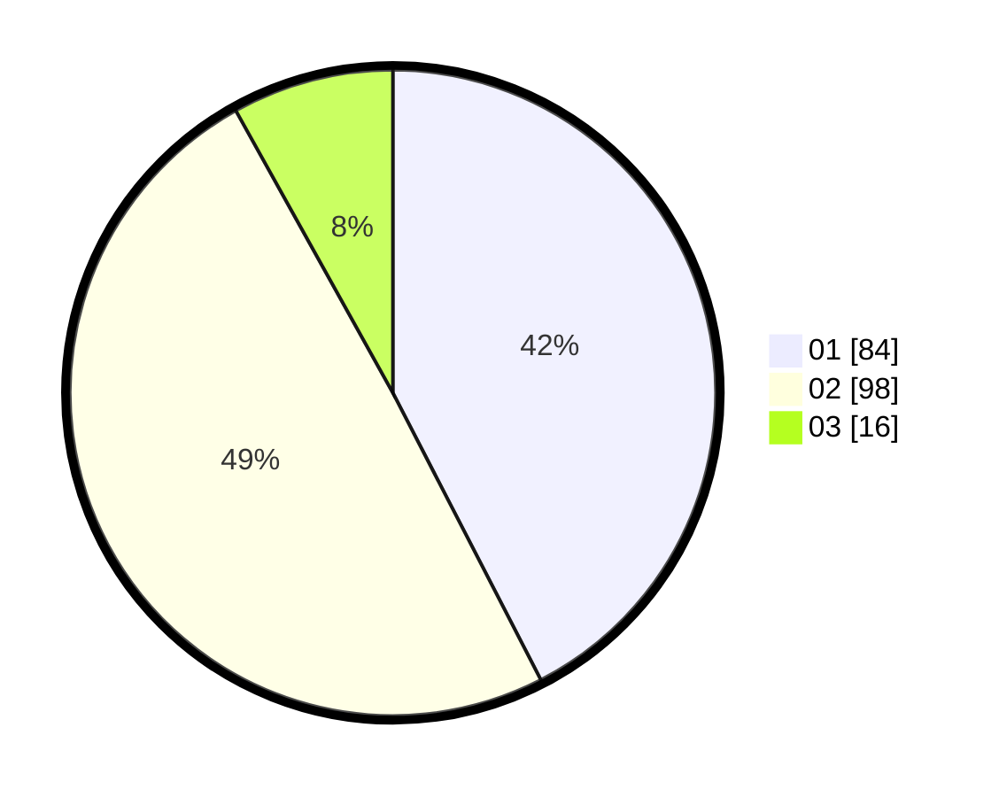

# Hasil

Hasil perolehan suara paslon dapat dilihat pada file paslon-01.txt, paslon-02.txt, dan paslon-03.txt.

Jika tidak ada, artinya data tersebut belum ada pada SIREKAP.

## Perolehan Suara

 * Paslon 01: **84**.
 * Paslon 02: **98**.
 * Paslon 03: **16**.

## Foto C Plano

https://sirekap-obj-formc.kpu.go.id/a7e5/pemilu/ppwp/31/73/06/10/04/3173061004036-20240215-231750--b724b0e3-4318-4df3-b3ab-8d00513cd34a.jpg

https://sirekap-obj-formc.kpu.go.id/a7e5/pemilu/ppwp/31/73/06/10/04/3173061004036-20240215-231754--888cf384-b92c-4df4-b978-809cfa165f17.jpg

https://sirekap-obj-formc.kpu.go.id/a7e5/pemilu/ppwp/31/73/06/10/04/3173061004036-20240215-231752--c7369fa6-ad20-4a56-9600-c65c4a76ebaf.jpg

## DATA PEMILIH TETAP

Jumlah pemilih dalam DPT: **198**.
 * L: **101**.
 * P: **97**.

## DATA PENGGUNA HAK PILIH

Jumlah pengguna hak pilih dalam DPT: **198**.
 * L: **101**.
 * P: **97**.

Jumlah pengguna hak pilih dalam DPTb: **0**.
 * L: **0**.
 * P: **0**.

Jumlah pengguna hak pilih dalam DPK: **2**.
 * L: **1**.
 * P: **1**.

Jumlah pengguna hak pilih: **200**.
 * L: **102**.
 * P: **98**.

## JUMLAH SUARA SAH DAN TIDAK SAH

JUMLAH SELURUH SUARA SAH: **198**.

JUMLAH SUARA TIDAK SAH: **2**.

JUMLAH SELURUH SUARA SAH DAN SUARA TIDAK SAH: **200**.
