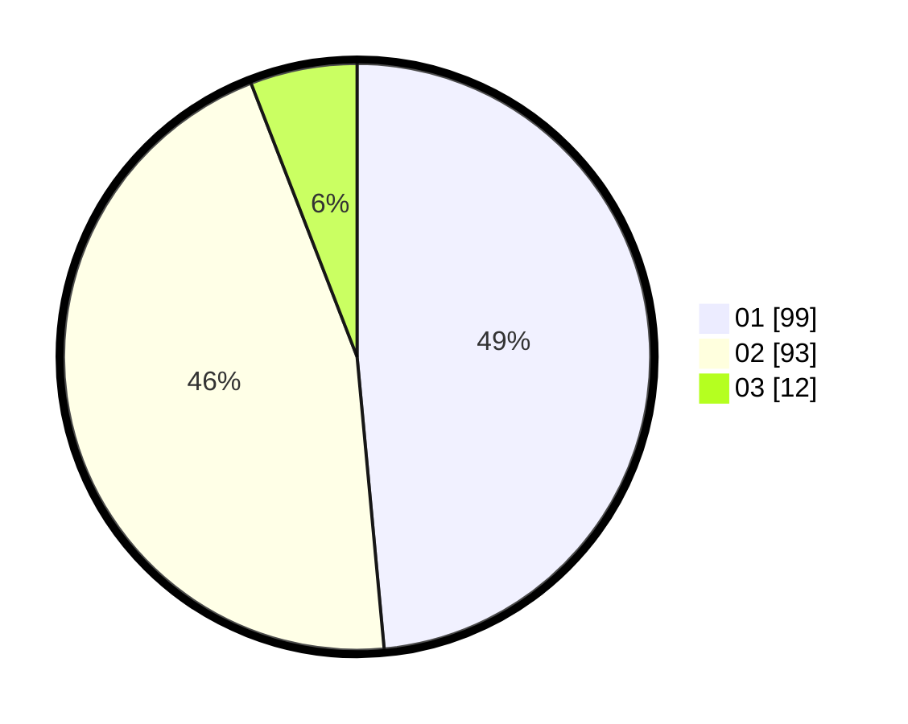

# Hasil

Hasil perolehan suara paslon dapat dilihat pada file paslon-01.txt, paslon-02.txt, dan paslon-03.txt.

Jika tidak ada, artinya data tersebut belum ada pada SIREKAP.

## Perolehan Suara

 * Paslon 01: **99**.
 * Paslon 02: **93**.
 * Paslon 03: **12**.

## Foto C Plano

https://sirekap-obj-formc.kpu.go.id/77e1/pemilu/ppwp/31/73/06/10/04/3173061004037-20240214-221422--ff7a733f-a146-4457-8efb-41279f0a891b.jpg

https://sirekap-obj-formc.kpu.go.id/77e1/pemilu/ppwp/31/73/06/10/04/3173061004037-20240214-221906--9dff75d9-ea19-40b0-9a6a-c13df2cb346c.jpg

https://sirekap-obj-formc.kpu.go.id/77e1/pemilu/ppwp/31/73/06/10/04/3173061004037-20240214-203617--a5a201c6-3c17-474a-a20f-766acb615ae1.jpg
