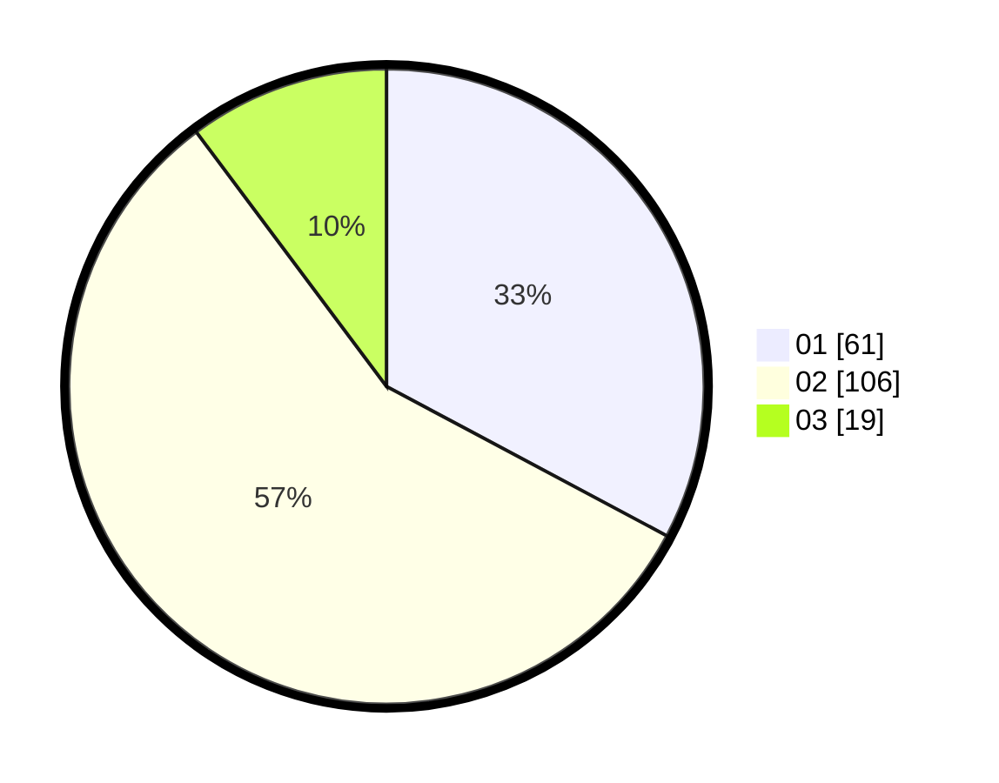

# Hasil

Hasil perolehan suara paslon dapat dilihat pada file paslon-01.txt, paslon-02.txt, dan paslon-03.txt.

Jika tidak ada, artinya data tersebut belum ada pada SIREKAP.

## Perolehan Suara

 * Paslon 01: **61**.
 * Paslon 02: **106**.
 * Paslon 03: **19**.

## Foto C Plano

https://sirekap-obj-formc.kpu.go.id/4b53/pemilu/ppwp/31/73/06/10/04/3173061004041-20240216-020338--3cf6b9d7-7f12-4b87-9ccb-8284ce04c4dd.jpg

https://sirekap-obj-formc.kpu.go.id/4b53/pemilu/ppwp/31/73/06/10/04/3173061004041-20240216-022624--df3cfef7-eaeb-46d5-bc4b-26005d28e75f.jpg

https://sirekap-obj-formc.kpu.go.id/4b53/pemilu/ppwp/31/73/06/10/04/3173061004041-20240216-020348--7ddf57df-2711-4c68-b6c4-db6e07519782.jpg

## DATA PEMILIH TETAP

Jumlah pemilih dalam DPT: **240**.
 * L: **128**.
 * P: **112**.

## DATA PENGGUNA HAK PILIH

Jumlah pengguna hak pilih dalam DPT: **190**.
 * L: **101**.
 * P: **89**.

Jumlah pengguna hak pilih dalam DPTb: **1**.
 * L: **0**.
 * P: **1**.

Jumlah pengguna hak pilih dalam DPK: **0**.
 * L: **0**.
 * P: **0**.

Jumlah pengguna hak pilih: **191**.
 * L: **101**.
 * P: **90**.

## JUMLAH SUARA SAH DAN TIDAK SAH

JUMLAH SELURUH SUARA SAH: **186**.

JUMLAH SUARA TIDAK SAH: **5**.

JUMLAH SELURUH SUARA SAH DAN SUARA TIDAK SAH: **191**.
