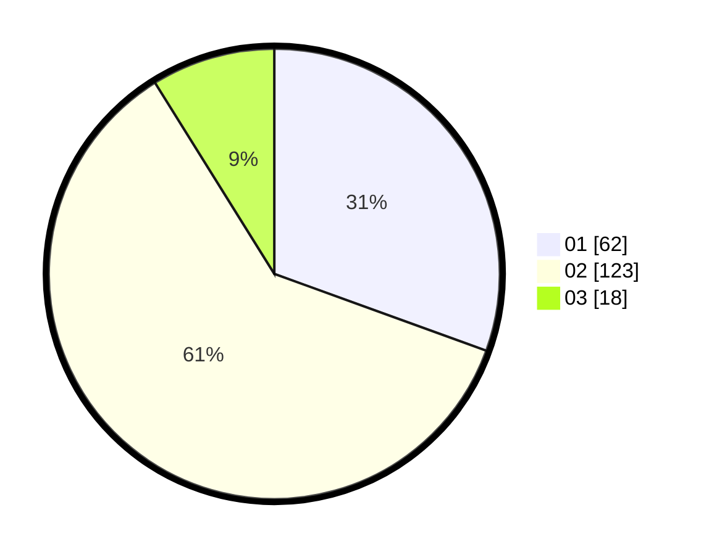

# Hasil

Hasil perolehan suara paslon dapat dilihat pada file paslon-01.txt, paslon-02.txt, dan paslon-03.txt.

Jika tidak ada, artinya data tersebut belum ada pada SIREKAP.

## Perolehan Suara

 * Paslon 01: **62**.
 * Paslon 02: **123**.
 * Paslon 03: **18**.

## Foto C Plano

https://sirekap-obj-formc.kpu.go.id/d0e0/pemilu/ppwp/31/73/06/10/04/3173061004045-20240215-213236--9cb82c61-b07f-458d-bd61-dd82125b6657.jpg

https://sirekap-obj-formc.kpu.go.id/d0e0/pemilu/ppwp/31/73/06/10/04/3173061004045-20240215-213238--5715e384-2a31-49ba-a37e-5bb741758d1b.jpg

https://sirekap-obj-formc.kpu.go.id/d0e0/pemilu/ppwp/31/73/06/10/04/3173061004045-20240215-213237--6fdd9f38-3123-463f-8d28-c0d6d7830020.jpg

## DATA PEMILIH TETAP

Jumlah pemilih dalam DPT: **269**.
 * L: **138**.
 * P: **131**.

## DATA PENGGUNA HAK PILIH

Jumlah pengguna hak pilih dalam DPT: **209**.
 * L: **106**.
 * P: **103**.

Jumlah pengguna hak pilih dalam DPTb: **0**.
 * L: **0**.
 * P: **0**.

Jumlah pengguna hak pilih dalam DPK: **0**.
 * L: **0**.
 * P: **0**.

Jumlah pengguna hak pilih: **209**.
 * L: **106**.
 * P: **103**.

## JUMLAH SUARA SAH DAN TIDAK SAH

JUMLAH SELURUH SUARA SAH: **203**.

JUMLAH SUARA TIDAK SAH: **6**.

JUMLAH SELURUH SUARA SAH DAN SUARA TIDAK SAH: **209**.
