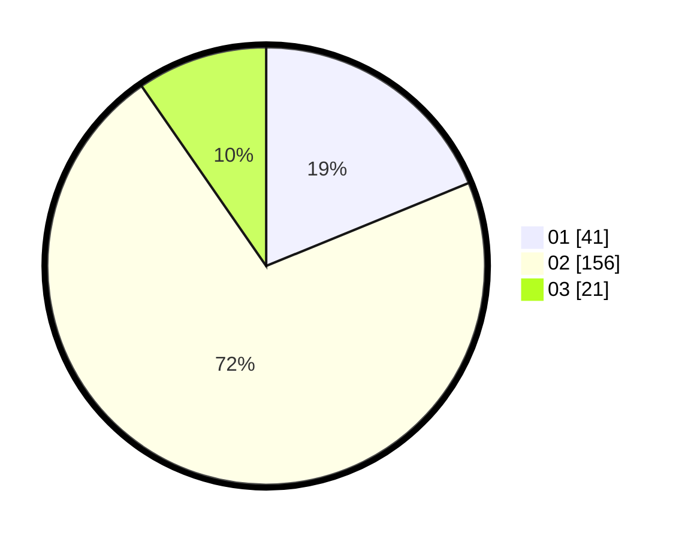

# Hasil

Hasil perolehan suara paslon dapat dilihat pada file paslon-01.txt, paslon-02.txt, dan paslon-03.txt.

Jika tidak ada, artinya data tersebut belum ada pada SIREKAP.

## Perolehan Suara

 * Paslon 01: **41**.
 * Paslon 02: **156**.
 * Paslon 03: **21**.

## Foto C Plano

https://sirekap-obj-formc.kpu.go.id/7ff5/pemilu/ppwp/31/73/06/10/04/3173061004049-20240216-002611--0c002f53-24aa-46e8-a13d-5670340b04f8.jpg

https://sirekap-obj-formc.kpu.go.id/7ff5/pemilu/ppwp/31/73/06/10/04/3173061004049-20240216-002614--81e20e62-4b69-4ac3-a59f-f94f54d6a7f6.jpg

https://sirekap-obj-formc.kpu.go.id/7ff5/pemilu/ppwp/31/73/06/10/04/3173061004049-20240216-002613--32fe33f1-e40f-4e3e-bd2d-8e2402c4f34b.jpg

## DATA PEMILIH TETAP

Jumlah pemilih dalam DPT: **275**.
 * L: **134**.
 * P: **141**.

## DATA PENGGUNA HAK PILIH

Jumlah pengguna hak pilih dalam DPT: **218**.
 * L: **101**.
 * P: **117**.

Jumlah pengguna hak pilih dalam DPTb: **1**.
 * L: **1**.
 * P: **0**.

Jumlah pengguna hak pilih dalam DPK: **1**.
 * L: **1**.
 * P: **0**.

Jumlah pengguna hak pilih: **220**.
 * L: **103**.
 * P: **117**.

## JUMLAH SUARA SAH DAN TIDAK SAH

JUMLAH SELURUH SUARA SAH: **218**.

JUMLAH SUARA TIDAK SAH: **2**.

JUMLAH SELURUH SUARA SAH DAN SUARA TIDAK SAH: **220**.
