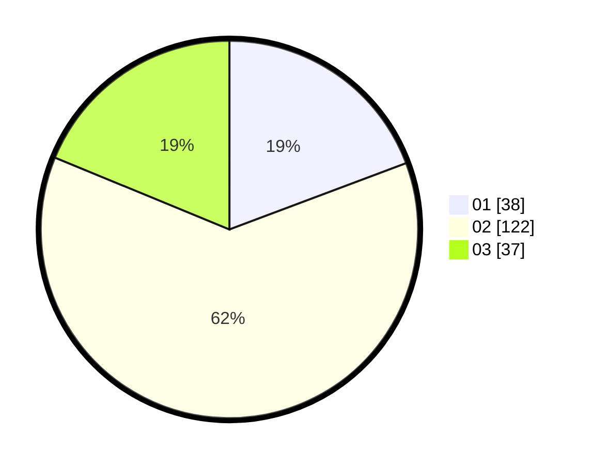

# Hasil

Hasil perolehan suara paslon dapat dilihat pada file paslon-01.txt, paslon-02.txt, dan paslon-03.txt.

Jika tidak ada, artinya data tersebut belum ada pada SIREKAP.

## Perolehan Suara

 * Paslon 01: **38**.
 * Paslon 02: **122**.
 * Paslon 03: **37**.

## Foto C Plano

https://sirekap-obj-formc.kpu.go.id/dc1e/pemilu/ppwp/31/73/06/10/04/3173061004051-20240216-012041--bad7bdde-ff65-4b99-876f-5202320d32ec.jpg

https://sirekap-obj-formc.kpu.go.id/dc1e/pemilu/ppwp/31/73/06/10/04/3173061004051-20240216-012043--76ed4b05-a138-428d-8983-5656ac9505e9.jpg

https://sirekap-obj-formc.kpu.go.id/dc1e/pemilu/ppwp/31/73/06/10/04/3173061004051-20240216-012042--10cb1236-552e-4265-b4ba-574086982dfb.jpg

## DATA PEMILIH TETAP

Jumlah pemilih dalam DPT: **272**.
 * L: **133**.
 * P: **139**.

## DATA PENGGUNA HAK PILIH

Jumlah pengguna hak pilih dalam DPT: **197**.
 * L: **93**.
 * P: **104**.

Jumlah pengguna hak pilih dalam DPTb: **0**.
 * L: **0**.
 * P: **0**.

Jumlah pengguna hak pilih dalam DPK: **4**.
 * L: **3**.
 * P: **1**.

Jumlah pengguna hak pilih: **201**.
 * L: **96**.
 * P: **105**.

## JUMLAH SUARA SAH DAN TIDAK SAH

JUMLAH SELURUH SUARA SAH: **197**.

JUMLAH SUARA TIDAK SAH: **4**.

JUMLAH SELURUH SUARA SAH DAN SUARA TIDAK SAH: **201**.
