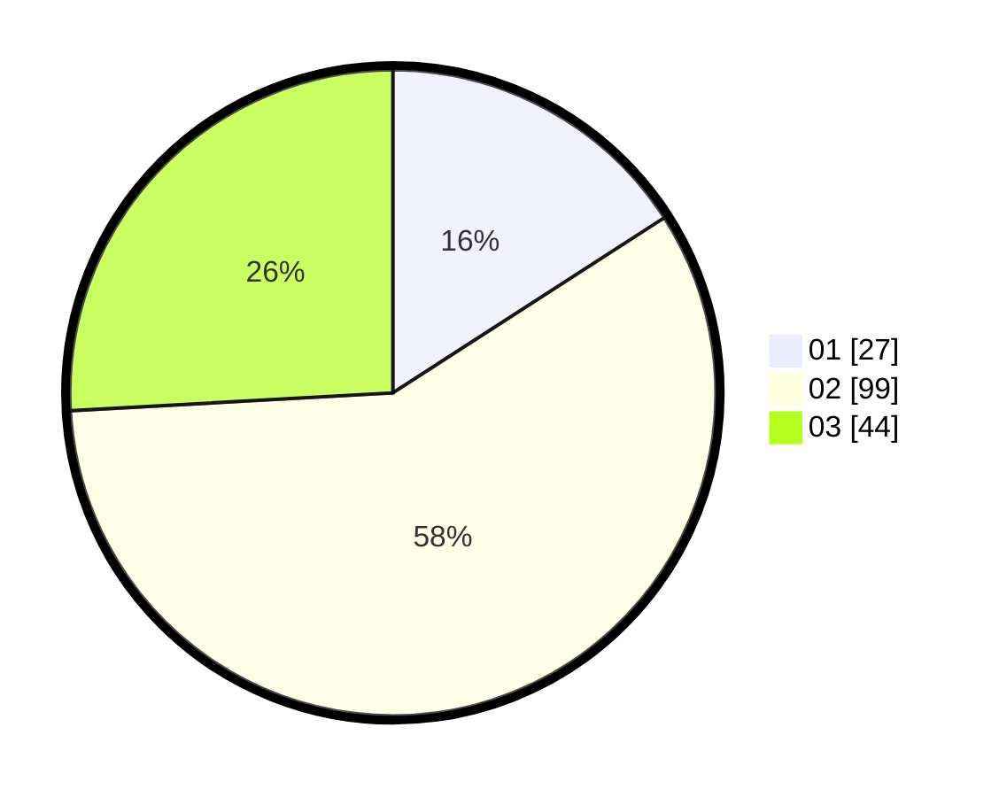

# Hasil

Hasil perolehan suara paslon dapat dilihat pada file paslon-01.txt, paslon-02.txt, dan paslon-03.txt.

Jika tidak ada, artinya data tersebut belum ada pada SIREKAP.

## Perolehan Suara

 * Paslon 01: **27**.
 * Paslon 02: **99**.
 * Paslon 03: **44**.

## Foto C Plano

https://sirekap-obj-formc.kpu.go.id/255b/pemilu/ppwp/31/73/06/10/04/3173061004055-20240215-231619--d9c42448-6249-4d12-aee8-8250c3d5332b.jpg

https://sirekap-obj-formc.kpu.go.id/255b/pemilu/ppwp/31/73/06/10/04/3173061004055-20240215-231621--b63860d6-72c3-4cbf-b89a-a692a40c4b27.jpg

https://sirekap-obj-formc.kpu.go.id/255b/pemilu/ppwp/31/73/06/10/04/3173061004055-20240215-231620--72f8cf07-57cc-4a4f-8959-fb044a058ff4.jpg

## DATA PEMILIH TETAP

Jumlah pemilih dalam DPT: **173**.
 * L: **83**.
 * P: **90**.

## DATA PENGGUNA HAK PILIH

Jumlah pengguna hak pilih dalam DPT: **173**.
 * L: **83**.
 * P: **90**.

Jumlah pengguna hak pilih dalam DPTb: **0**.
 * L: **0**.
 * P: **0**.

Jumlah pengguna hak pilih dalam DPK: **2**.
 * L: **0**.
 * P: **2**.

Jumlah pengguna hak pilih: **175**.
 * L: **83**.
 * P: **92**.

## JUMLAH SUARA SAH DAN TIDAK SAH

JUMLAH SELURUH SUARA SAH: **170**.

JUMLAH SUARA TIDAK SAH: **5**.

JUMLAH SELURUH SUARA SAH DAN SUARA TIDAK SAH: **175**.
