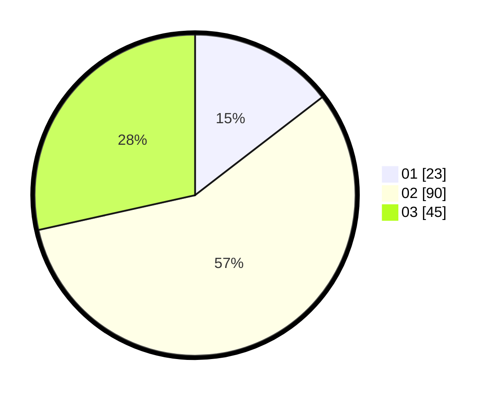

# Hasil

Hasil perolehan suara paslon dapat dilihat pada file paslon-01.txt, paslon-02.txt, dan paslon-03.txt.

Jika tidak ada, artinya data tersebut belum ada pada SIREKAP.

## Perolehan Suara

 * Paslon 01: **23**.
 * Paslon 02: **90**.
 * Paslon 03: **45**.

## Foto C Plano

https://sirekap-obj-formc.kpu.go.id/9021/pemilu/ppwp/31/73/06/10/04/3173061004056-20240215-205629--46086fee-7a7e-4bf4-b386-e75b9dae680b.jpg

https://sirekap-obj-formc.kpu.go.id/9021/pemilu/ppwp/31/73/06/10/04/3173061004056-20240215-205632--c8a4a649-5c7e-4995-8c23-950dbdd02ebf.jpg

https://sirekap-obj-formc.kpu.go.id/9021/pemilu/ppwp/31/73/06/10/04/3173061004056-20240215-205630--a8e3ed50-88b9-474e-ac7f-a977f600c7e1.jpg

## DATA PEMILIH TETAP

Jumlah pemilih dalam DPT: **266**.
 * L: **127**.
 * P: **139**.

## DATA PENGGUNA HAK PILIH

Jumlah pengguna hak pilih dalam DPT: **159**.
 * L: **71**.
 * P: **88**.

Jumlah pengguna hak pilih dalam DPTb: **3**.
 * L: **1**.
 * P: **2**.

Jumlah pengguna hak pilih dalam DPK: **0**.
 * L: **0**.
 * P: **0**.

Jumlah pengguna hak pilih: **162**.
 * L: **72**.
 * P: **90**.

## JUMLAH SUARA SAH DAN TIDAK SAH

JUMLAH SELURUH SUARA SAH: **158**.

JUMLAH SUARA TIDAK SAH: **4**.

JUMLAH SELURUH SUARA SAH DAN SUARA TIDAK SAH: **162**.
