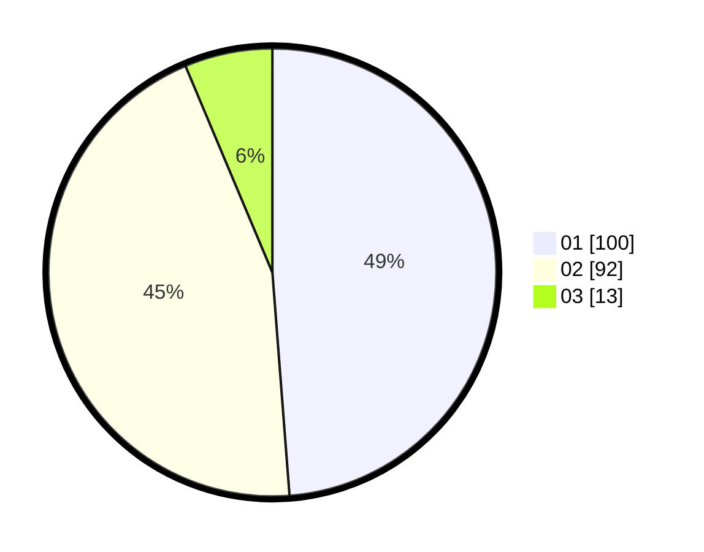

# Hasil

Hasil perolehan suara paslon dapat dilihat pada file paslon-01.txt, paslon-02.txt, dan paslon-03.txt.

Jika tidak ada, artinya data tersebut belum ada pada SIREKAP.

## Perolehan Suara

 * Paslon 01: **100**.
 * Paslon 02: **92**.
 * Paslon 03: **13**.

## Foto C Plano

https://sirekap-obj-formc.kpu.go.id/5916/pemilu/ppwp/31/73/06/10/04/3173061004061-20240214-193657--6ddfdb0c-9d36-4497-aae9-b710a6da77c3.jpg

https://sirekap-obj-formc.kpu.go.id/5916/pemilu/ppwp/31/73/06/10/04/3173061004061-20240216-044802--a896710e-9882-467d-961f-e4fe065b250f.jpg

https://sirekap-obj-formc.kpu.go.id/5916/pemilu/ppwp/31/73/06/10/04/3173061004061-20240216-044801--879643df-5737-4aca-93a6-92ca960bec82.jpg

## DATA PEMILIH TETAP

Jumlah pemilih dalam DPT: **254**.
 * L: **513**.
 * P: **141**.

## DATA PENGGUNA HAK PILIH

Jumlah pengguna hak pilih dalam DPT: **209**.
 * L: **90**.
 * P: **119**.

Jumlah pengguna hak pilih dalam DPTb: **0**.
 * L: **0**.
 * P: **0**.

Jumlah pengguna hak pilih dalam DPK: **2**.
 * L: **1**.
 * P: **1**.

Jumlah pengguna hak pilih: **211**.
 * L: **91**.
 * P: **120**.

## JUMLAH SUARA SAH DAN TIDAK SAH

JUMLAH SELURUH SUARA SAH: **205**.

JUMLAH SUARA TIDAK SAH: **6**.

JUMLAH SELURUH SUARA SAH DAN SUARA TIDAK SAH: **211**.
