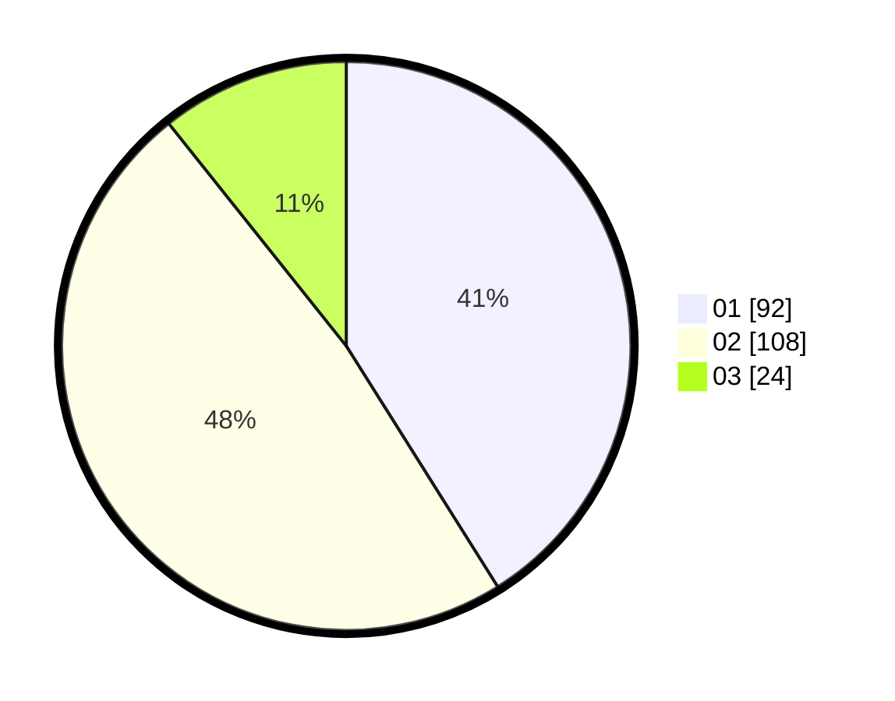

# Hasil

Hasil perolehan suara paslon dapat dilihat pada file paslon-01.txt, paslon-02.txt, dan paslon-03.txt.

Jika tidak ada, artinya data tersebut belum ada pada SIREKAP.

## Perolehan Suara

 * Paslon 01: **92**.
 * Paslon 02: **108**.
 * Paslon 03: **24**.

## Foto C Plano

https://sirekap-obj-formc.kpu.go.id/bbe5/pemilu/ppwp/31/73/06/10/04/3173061004062-20240216-040744--85d02170-6ed7-4ae6-b265-72db19f72b9d.jpg

https://sirekap-obj-formc.kpu.go.id/bbe5/pemilu/ppwp/31/73/06/10/04/3173061004062-20240216-035600--8034fa8d-6504-45aa-9047-edd3dde7fd60.jpg

https://sirekap-obj-formc.kpu.go.id/bbe5/pemilu/ppwp/31/73/06/10/04/3173061004062-20240216-035555--c274444f-db16-4a7c-972c-b7dd0c2b49ad.jpg

## DATA PEMILIH TETAP

Jumlah pemilih dalam DPT: **290**.
 * L: **149**.
 * P: **141**.

## DATA PENGGUNA HAK PILIH

Jumlah pengguna hak pilih dalam DPT: **228**.
 * L: **114**.
 * P: **114**.

Jumlah pengguna hak pilih dalam DPTb: **0**.
 * L: **0**.
 * P: **0**.

Jumlah pengguna hak pilih dalam DPK: **0**.
 * L: **0**.
 * P: **0**.

Jumlah pengguna hak pilih: **228**.
 * L: **114**.
 * P: **114**.

## JUMLAH SUARA SAH DAN TIDAK SAH

JUMLAH SELURUH SUARA SAH: **224**.

JUMLAH SUARA TIDAK SAH: **4**.

JUMLAH SELURUH SUARA SAH DAN SUARA TIDAK SAH: **228**.
