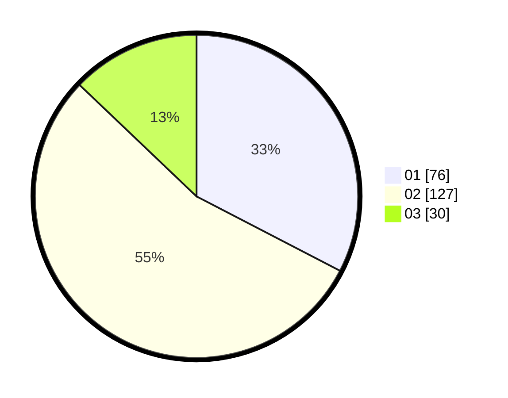

# Hasil

Hasil perolehan suara paslon dapat dilihat pada file paslon-01.txt, paslon-02.txt, dan paslon-03.txt.

Jika tidak ada, artinya data tersebut belum ada pada SIREKAP.

## Perolehan Suara

 * Paslon 01: **76**.
 * Paslon 02: **127**.
 * Paslon 03: **30**.

## Foto C Plano

https://sirekap-obj-formc.kpu.go.id/c1d9/pemilu/ppwp/31/73/06/10/04/3173061004064-20240215-231152--a4f01de6-e6be-4f58-89a4-7329be14cd02.jpg

https://sirekap-obj-formc.kpu.go.id/c1d9/pemilu/ppwp/31/73/06/10/04/3173061004064-20240215-231156--07f97e4a-4a3f-4220-bfb6-7cafd3d8cd57.jpg

https://sirekap-obj-formc.kpu.go.id/c1d9/pemilu/ppwp/31/73/06/10/04/3173061004064-20240215-231154--92f69c27-9993-49be-a0f0-83d05a5eb47f.jpg

## DATA PEMILIH TETAP

Jumlah pemilih dalam DPT: **287**.
 * L: **142**.
 * P: **145**.

## DATA PENGGUNA HAK PILIH

Jumlah pengguna hak pilih dalam DPT: **235**.
 * L: **113**.
 * P: **122**.

Jumlah pengguna hak pilih dalam DPTb: **0**.
 * L: **0**.
 * P: **0**.

Jumlah pengguna hak pilih dalam DPK: **4**.
 * L: **2**.
 * P: **2**.

Jumlah pengguna hak pilih: **239**.
 * L: **115**.
 * P: **124**.

## JUMLAH SUARA SAH DAN TIDAK SAH

JUMLAH SELURUH SUARA SAH: **233**.

JUMLAH SUARA TIDAK SAH: **6**.

JUMLAH SELURUH SUARA SAH DAN SUARA TIDAK SAH: **239**.
