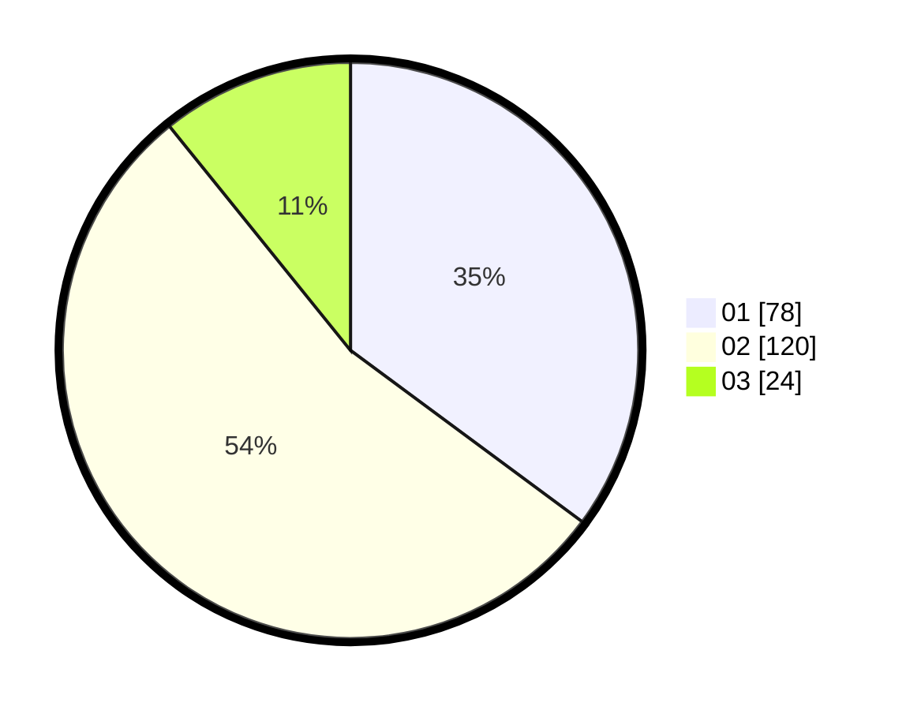

# Hasil

Hasil perolehan suara paslon dapat dilihat pada file paslon-01.txt, paslon-02.txt, dan paslon-03.txt.

Jika tidak ada, artinya data tersebut belum ada pada SIREKAP.

## Perolehan Suara

 * Paslon 01: **78**.
 * Paslon 02: **120**.
 * Paslon 03: **24**.

## Foto C Plano

https://sirekap-obj-formc.kpu.go.id/6ce8/pemilu/ppwp/31/73/06/10/04/3173061004066-20240214-191729--60a3fcd5-9fdc-43d3-a3fc-c2570324d75e.jpg

https://sirekap-obj-formc.kpu.go.id/6ce8/pemilu/ppwp/31/73/06/10/04/3173061004066-20240214-205111--de8f61b4-e544-498c-a81d-3148c9776765.jpg

https://sirekap-obj-formc.kpu.go.id/6ce8/pemilu/ppwp/31/73/06/10/04/3173061004066-20240214-210213--c41519a6-40c2-417e-87dd-4881e482b164.jpg
