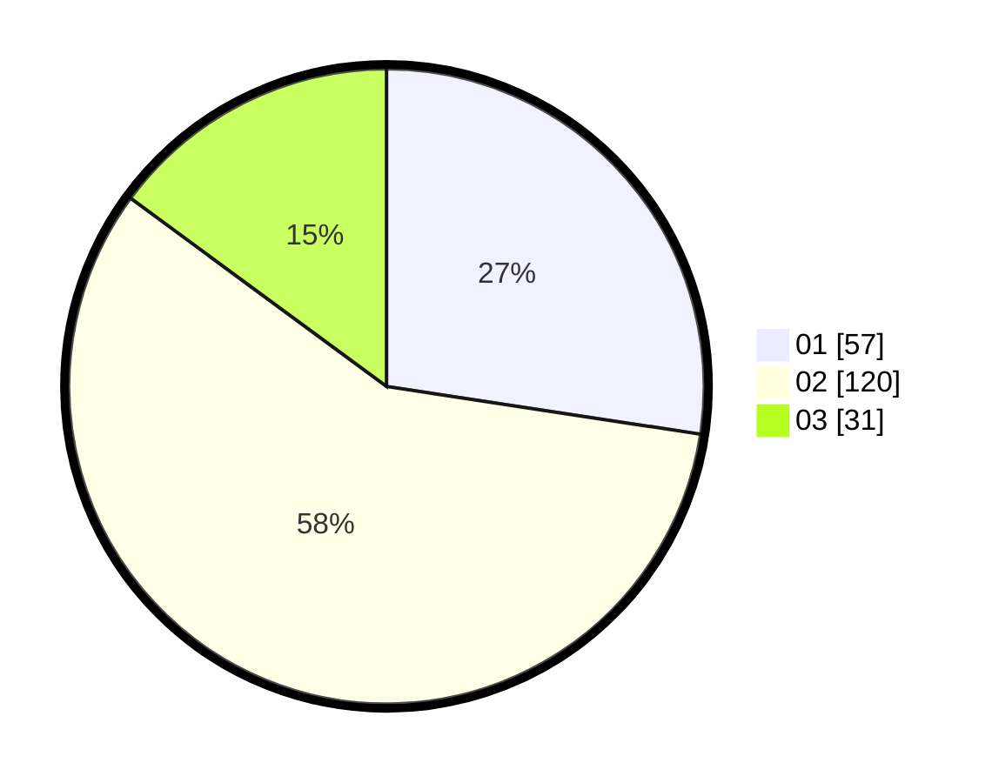

# Hasil

Hasil perolehan suara paslon dapat dilihat pada file paslon-01.txt, paslon-02.txt, dan paslon-03.txt.

Jika tidak ada, artinya data tersebut belum ada pada SIREKAP.

## Perolehan Suara

 * Paslon 01: **57**.
 * Paslon 02: **120**.
 * Paslon 03: **31**.

## Foto C Plano

https://sirekap-obj-formc.kpu.go.id/1795/pemilu/ppwp/31/73/06/10/04/3173061004072-20240214-210354--55c6e764-ce16-4011-aa07-afbda9da319b.jpg

https://sirekap-obj-formc.kpu.go.id/1795/pemilu/ppwp/31/73/06/10/04/3173061004072-20240214-210740--7291f89d-b2f4-4b07-b1ff-4f0cbeeeac13.jpg

https://sirekap-obj-formc.kpu.go.id/1795/pemilu/ppwp/31/73/06/10/04/3173061004072-20240214-210834--294b4c0b-6b95-482c-bb4c-9ee30216f555.jpg

## DATA PEMILIH TETAP

Jumlah pemilih dalam DPT: **261**.
 * L: **128**.
 * P: **133**.

## DATA PENGGUNA HAK PILIH

Jumlah pengguna hak pilih dalam DPT: **205**.
 * L: **100**.
 * P: **105**.

Jumlah pengguna hak pilih dalam DPTb: **1**.
 * L: **1**.
 * P: **0**.

Jumlah pengguna hak pilih dalam DPK: **7**.
 * L: **3**.
 * P: **4**.

Jumlah pengguna hak pilih: **213**.
 * L: **104**.
 * P: **109**.

## JUMLAH SUARA SAH DAN TIDAK SAH

JUMLAH SELURUH SUARA SAH: **208**.

JUMLAH SUARA TIDAK SAH: **5**.

JUMLAH SELURUH SUARA SAH DAN SUARA TIDAK SAH: **213**.
