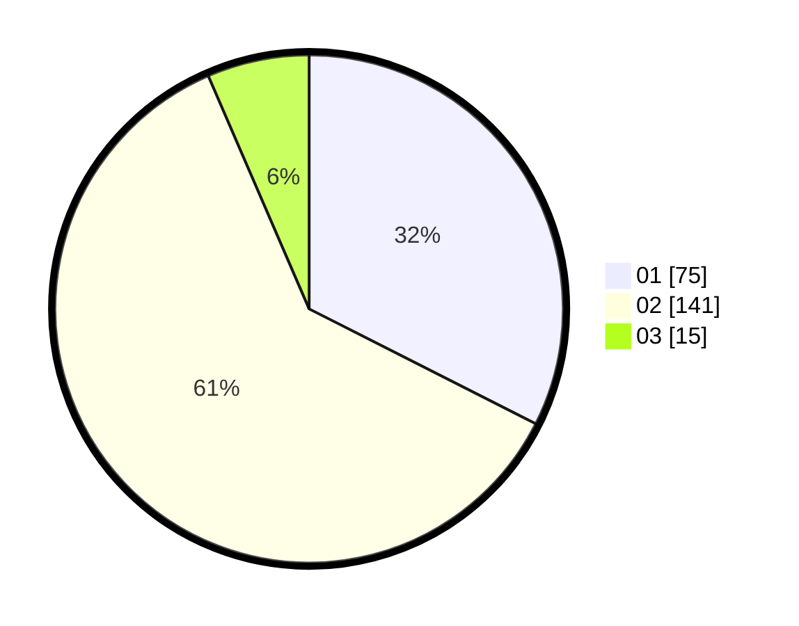

# Hasil

Hasil perolehan suara paslon dapat dilihat pada file paslon-01.txt, paslon-02.txt, dan paslon-03.txt.

Jika tidak ada, artinya data tersebut belum ada pada SIREKAP.

## Perolehan Suara

 * Paslon 01: **75**.
 * Paslon 02: **141**.
 * Paslon 03: **15**.

## Foto C Plano

https://sirekap-obj-formc.kpu.go.id/a108/pemilu/ppwp/31/73/06/10/04/3173061004076-20240215-103036--a5c48d53-64aa-418c-a653-6df9e28d2858.jpg

https://sirekap-obj-formc.kpu.go.id/a108/pemilu/ppwp/31/73/06/10/04/3173061004076-20240214-195138--08e2e0e9-6a5c-41b6-b30e-72accaa66816.jpg

https://sirekap-obj-formc.kpu.go.id/a108/pemilu/ppwp/31/73/06/10/04/3173061004076-20240214-193833--3303ac8c-6ea2-4802-ad49-7c707cc77df6.jpg
