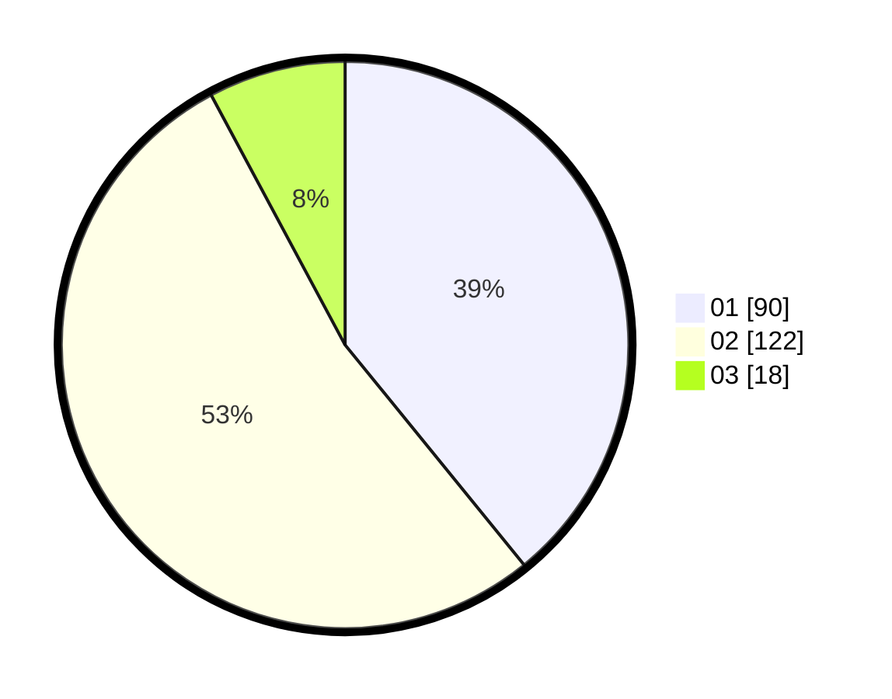

# Hasil

Hasil perolehan suara paslon dapat dilihat pada file paslon-01.txt, paslon-02.txt, dan paslon-03.txt.

Jika tidak ada, artinya data tersebut belum ada pada SIREKAP.

## Perolehan Suara

 * Paslon 01: **90**.
 * Paslon 02: **122**.
 * Paslon 03: **18**.

## Foto C Plano

https://sirekap-obj-formc.kpu.go.id/9fed/pemilu/ppwp/31/73/06/10/04/3173061004078-20240214-225817--dcf75e85-e985-41bf-afab-3a5dc57bd09f.jpg

https://sirekap-obj-formc.kpu.go.id/9fed/pemilu/ppwp/31/73/06/10/04/3173061004078-20240214-225953--fb1483ea-52f8-4664-a776-87bebdfec11a.jpg

https://sirekap-obj-formc.kpu.go.id/9fed/pemilu/ppwp/31/73/06/10/04/3173061004078-20240214-230144--8710785d-21cb-4219-8048-66cb78d17341.jpg
