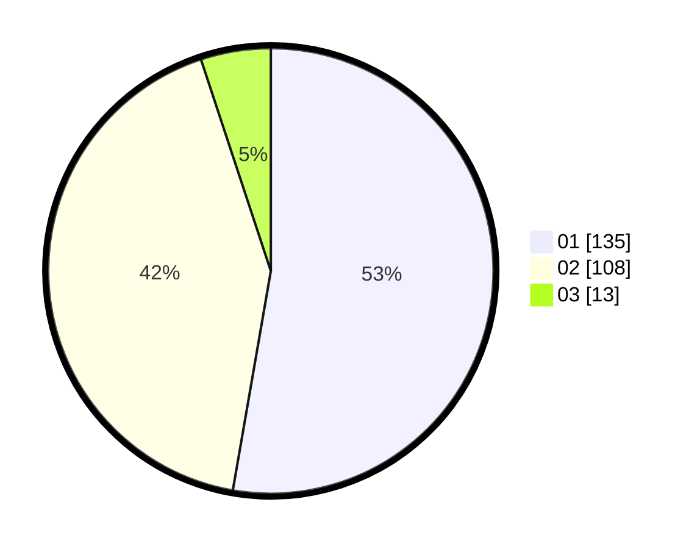

# Hasil

Hasil perolehan suara paslon dapat dilihat pada file paslon-01.txt, paslon-02.txt, dan paslon-03.txt.

Jika tidak ada, artinya data tersebut belum ada pada SIREKAP.

## Perolehan Suara

 * Paslon 01: **135**.
 * Paslon 02: **108**.
 * Paslon 03: **13**.

## Foto C Plano

https://sirekap-obj-formc.kpu.go.id/61db/pemilu/ppwp/31/73/06/10/04/3173061004079-20240216-120544--8d2b5088-b3ca-4b11-8616-0bacdb198dfc.jpg

https://sirekap-obj-formc.kpu.go.id/61db/pemilu/ppwp/31/73/06/10/04/3173061004079-20240216-120554--93bfea93-7692-400a-afe9-d0047c2e9b3b.jpg

https://sirekap-obj-formc.kpu.go.id/61db/pemilu/ppwp/31/73/06/10/04/3173061004079-20240216-120547--b324d8c6-52d5-4f68-b70b-23ab4a062c0a.jpg

## DATA PEMILIH TETAP

Jumlah pemilih dalam DPT: **293**.
 * L: **151**.
 * P: **142**.

## DATA PENGGUNA HAK PILIH

Jumlah pengguna hak pilih dalam DPT: **262**.
 * L: **131**.
 * P: **131**.

Jumlah pengguna hak pilih dalam DPTb: **0**.
 * L: **0**.
 * P: **0**.

Jumlah pengguna hak pilih dalam DPK: **0**.
 * L: **0**.
 * P: **0**.

Jumlah pengguna hak pilih: **262**.
 * L: **131**.
 * P: **131**.

## JUMLAH SUARA SAH DAN TIDAK SAH

JUMLAH SELURUH SUARA SAH: **256**.

JUMLAH SUARA TIDAK SAH: **6**.

JUMLAH SELURUH SUARA SAH DAN SUARA TIDAK SAH: **262**.
