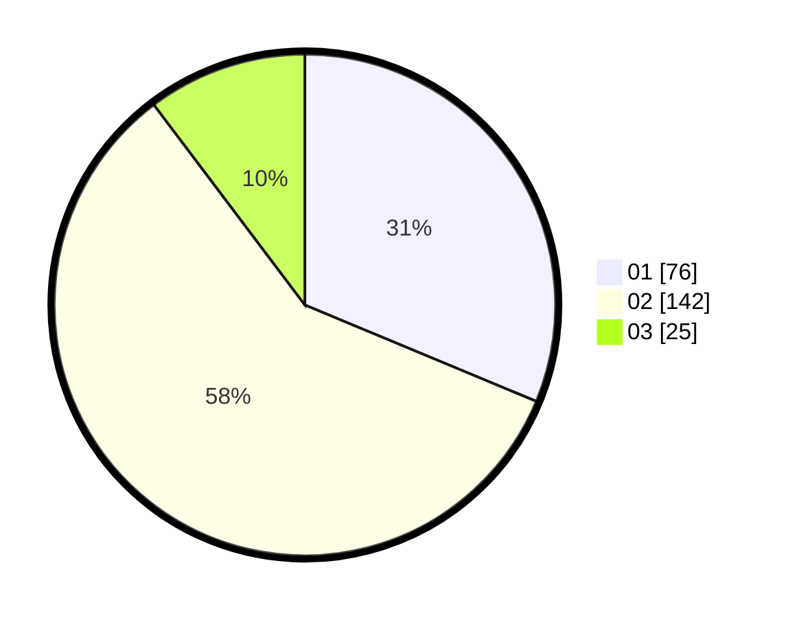

# Hasil

Hasil perolehan suara paslon dapat dilihat pada file paslon-01.txt, paslon-02.txt, dan paslon-03.txt.

Jika tidak ada, artinya data tersebut belum ada pada SIREKAP.

## Perolehan Suara

 * Paslon 01: **76**.
 * Paslon 02: **142**.
 * Paslon 03: **25**.

## Foto C Plano

https://sirekap-obj-formc.kpu.go.id/fce8/pemilu/ppwp/31/73/06/10/04/3173061004085-20240214-231054--b941730d-6bb7-4bc3-83d7-ae73e442a1af.jpg

https://sirekap-obj-formc.kpu.go.id/fce8/pemilu/ppwp/31/73/06/10/04/3173061004085-20240214-231215--ac81846c-01ee-4d36-a6f9-99ebc5044c26.jpg

https://sirekap-obj-formc.kpu.go.id/fce8/pemilu/ppwp/31/73/06/10/04/3173061004085-20240214-231317--9f5df088-8be6-451f-8fcd-a8d823fa9ed9.jpg
