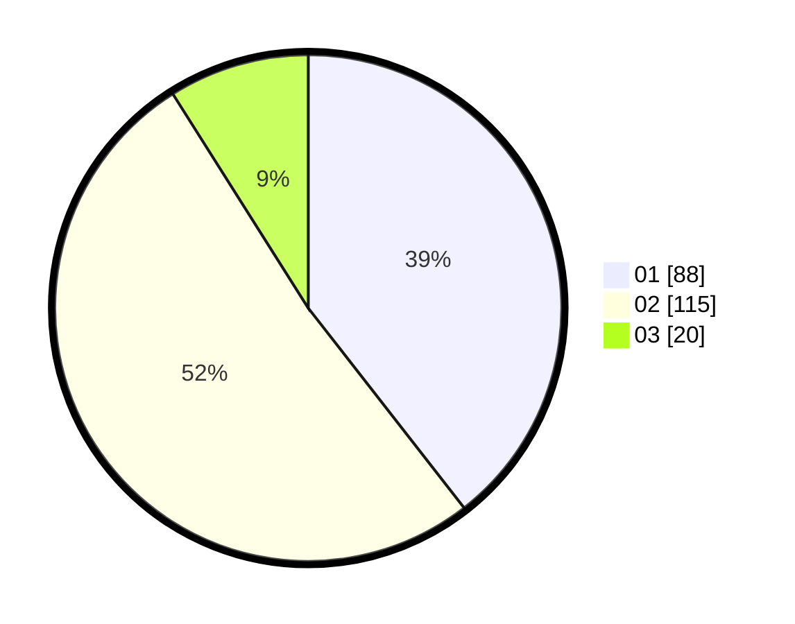

# Hasil

Hasil perolehan suara paslon dapat dilihat pada file paslon-01.txt, paslon-02.txt, dan paslon-03.txt.

Jika tidak ada, artinya data tersebut belum ada pada SIREKAP.

## Perolehan Suara

 * Paslon 01: **88**.
 * Paslon 02: **115**.
 * Paslon 03: **20**.

## Foto C Plano

https://sirekap-obj-formc.kpu.go.id/6279/pemilu/ppwp/31/73/06/10/04/3173061004086-20240216-134332--e396f226-d481-41db-8fa8-712b9d9d06a1.jpg

https://sirekap-obj-formc.kpu.go.id/6279/pemilu/ppwp/31/73/06/10/04/3173061004086-20240216-134334--735e42e2-3871-400c-bec9-3a0df0ee9d10.jpg

https://sirekap-obj-formc.kpu.go.id/6279/pemilu/ppwp/31/73/06/10/04/3173061004086-20240216-134333--4f2911b6-01d6-4ddc-a456-9a63c560046c.jpg

## DATA PEMILIH TETAP

Jumlah pemilih dalam DPT: **297**.
 * L: **148**.
 * P: **149**.

## DATA PENGGUNA HAK PILIH

Jumlah pengguna hak pilih dalam DPT: **228**.
 * L: **107**.
 * P: **121**.

Jumlah pengguna hak pilih dalam DPTb: **1**.
 * L: **1**.
 * P: **0**.

Jumlah pengguna hak pilih dalam DPK: **0**.
 * L: **0**.
 * P: **0**.

Jumlah pengguna hak pilih: **229**.
 * L: **108**.
 * P: **121**.

## JUMLAH SUARA SAH DAN TIDAK SAH

JUMLAH SELURUH SUARA SAH: **223**.

JUMLAH SUARA TIDAK SAH: **6**.

JUMLAH SELURUH SUARA SAH DAN SUARA TIDAK SAH: **229**.
