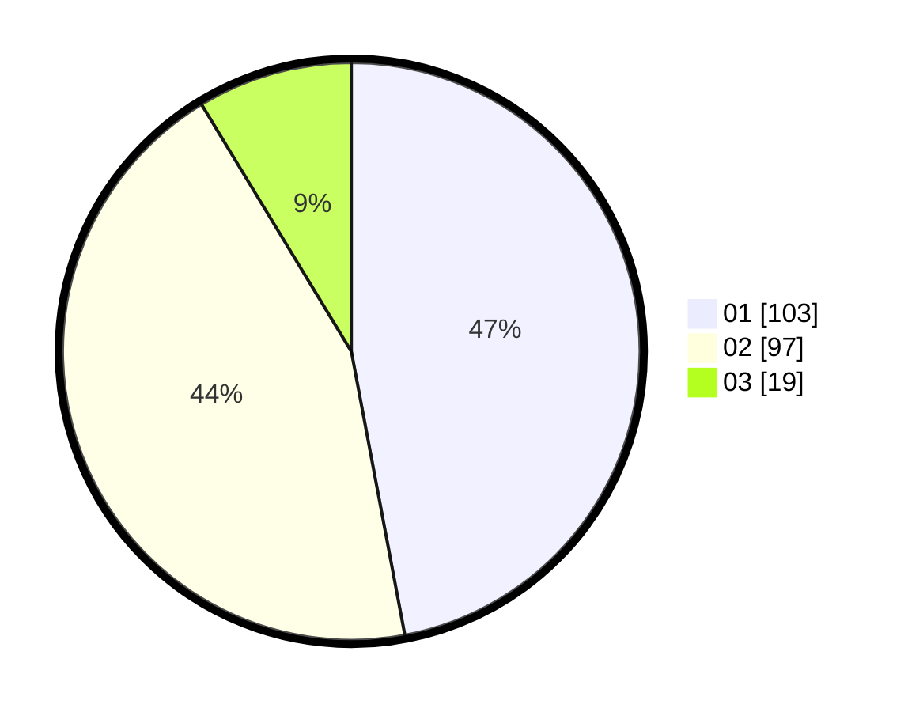

# Hasil

Hasil perolehan suara paslon dapat dilihat pada file paslon-01.txt, paslon-02.txt, dan paslon-03.txt.

Jika tidak ada, artinya data tersebut belum ada pada SIREKAP.

## Perolehan Suara

 * Paslon 01: **103**.
 * Paslon 02: **97**.
 * Paslon 03: **19**.

## Foto C Plano

https://sirekap-obj-formc.kpu.go.id/f165/pemilu/ppwp/31/73/06/10/04/3173061004087-20240214-203126--829d9ee4-8a11-4ddb-a5f1-a9c0d4ceff70.jpg

https://sirekap-obj-formc.kpu.go.id/f165/pemilu/ppwp/31/73/06/10/04/3173061004087-20240214-233619--5896ae5d-8535-4ed8-a287-69f440926038.jpg

https://sirekap-obj-formc.kpu.go.id/f165/pemilu/ppwp/31/73/06/10/04/3173061004087-20240214-210526--1cb341ea-cb7c-40f3-8e6d-e879ae6a62fb.jpg

## DATA PEMILIH TETAP

Jumlah pemilih dalam DPT: **225**.
 * L: **115**.
 * P: **110**.

## DATA PENGGUNA HAK PILIH

Jumlah pengguna hak pilih dalam DPT: **225**.
 * L: **115**.
 * P: **110**.

Jumlah pengguna hak pilih dalam DPTb: **0**.
 * L: **0**.
 * P: **0**.

Jumlah pengguna hak pilih dalam DPK: **1**.
 * L: **1**.
 * P: **0**.

Jumlah pengguna hak pilih: **226**.
 * L: **116**.
 * P: **110**.

## JUMLAH SUARA SAH DAN TIDAK SAH

JUMLAH SELURUH SUARA SAH: **219**.

JUMLAH SUARA TIDAK SAH: **6**.

JUMLAH SELURUH SUARA SAH DAN SUARA TIDAK SAH: **0**.
