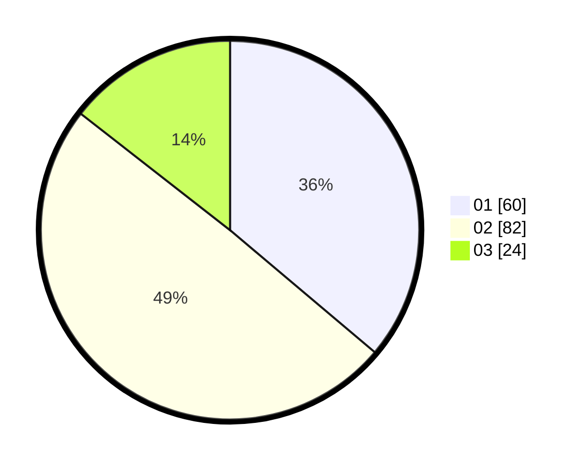

# Hasil

Hasil perolehan suara paslon dapat dilihat pada file paslon-01.txt, paslon-02.txt, dan paslon-03.txt.

Jika tidak ada, artinya data tersebut belum ada pada SIREKAP.

## Perolehan Suara

 * Paslon 01: **60**.
 * Paslon 02: **82**.
 * Paslon 03: **24**.

## Foto C Plano

https://sirekap-obj-formc.kpu.go.id/7095/pemilu/ppwp/31/73/06/10/04/3173061004088-20240214-185008--e1645acd-253a-4a2a-891e-a27b260b0b38.jpg

https://sirekap-obj-formc.kpu.go.id/7095/pemilu/ppwp/31/73/06/10/04/3173061004088-20240214-185154--35062d33-39a7-4325-b498-b840d9db6869.jpg

https://sirekap-obj-formc.kpu.go.id/7095/pemilu/ppwp/31/73/06/10/04/3173061004088-20240214-185154--592c8bca-0038-4a65-b336-314c50af9845.jpg

## DATA PEMILIH TETAP

Jumlah pemilih dalam DPT: **226**.
 * L: **114**.
 * P: **112**.

## DATA PENGGUNA HAK PILIH

Jumlah pengguna hak pilih dalam DPT: **173**.
 * L: **82**.
 * P: **91**.

Jumlah pengguna hak pilih dalam DPTb: **0**.
 * L: **0**.
 * P: **0**.

Jumlah pengguna hak pilih dalam DPK: **0**.
 * L: **0**.
 * P: **0**.

Jumlah pengguna hak pilih: **173**.
 * L: **82**.
 * P: **91**.

## JUMLAH SUARA SAH DAN TIDAK SAH

JUMLAH SELURUH SUARA SAH: **166**.

JUMLAH SUARA TIDAK SAH: **7**.

JUMLAH SELURUH SUARA SAH DAN SUARA TIDAK SAH: **173**.
