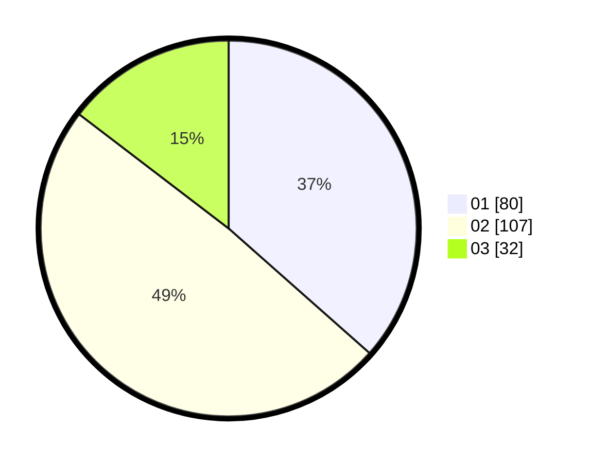

# Hasil

Hasil perolehan suara paslon dapat dilihat pada file paslon-01.txt, paslon-02.txt, dan paslon-03.txt.

Jika tidak ada, artinya data tersebut belum ada pada SIREKAP.

## Perolehan Suara

 * Paslon 01: **80**.
 * Paslon 02: **107**.
 * Paslon 03: **32**.

## Foto C Plano

https://sirekap-obj-formc.kpu.go.id/eaab/pemilu/ppwp/31/73/06/10/04/3173061004089-20240215-153709--586ba4b5-99d2-4035-932e-28ba6ebc6e47.jpg

https://sirekap-obj-formc.kpu.go.id/eaab/pemilu/ppwp/31/73/06/10/04/3173061004089-20240215-153730--bb5400a0-8e63-455a-96ce-78302dd5e4bd.jpg

https://sirekap-obj-formc.kpu.go.id/eaab/pemilu/ppwp/31/73/06/10/04/3173061004089-20240215-153719--d561ae4e-2e13-4aa8-8b25-e1af7ac06b04.jpg

## DATA PEMILIH TETAP

Jumlah pemilih dalam DPT: **219**.
 * L: **113**.
 * P: **106**.

## DATA PENGGUNA HAK PILIH

Jumlah pengguna hak pilih dalam DPT: **219**.
 * L: **113**.
 * P: **106**.

Jumlah pengguna hak pilih dalam DPTb: **0**.
 * L: **0**.
 * P: **0**.

Jumlah pengguna hak pilih dalam DPK: **2**.
 * L: **1**.
 * P: **1**.

Jumlah pengguna hak pilih: **221**.
 * L: **114**.
 * P: **107**.

## JUMLAH SUARA SAH DAN TIDAK SAH

JUMLAH SELURUH SUARA SAH: **219**.

JUMLAH SUARA TIDAK SAH: **2**.

JUMLAH SELURUH SUARA SAH DAN SUARA TIDAK SAH: **221**.
