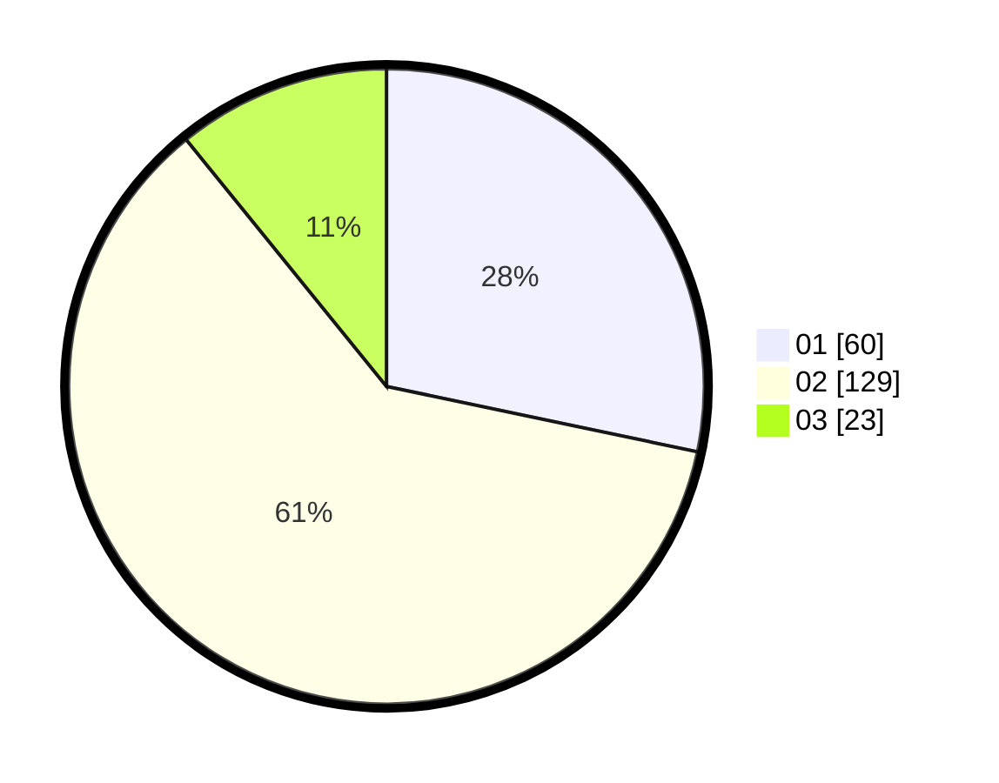

# Hasil

Hasil perolehan suara paslon dapat dilihat pada file paslon-01.txt, paslon-02.txt, dan paslon-03.txt.

Jika tidak ada, artinya data tersebut belum ada pada SIREKAP.

## Perolehan Suara

 * Paslon 01: **60**.
 * Paslon 02: **129**.
 * Paslon 03: **23**.

## Foto C Plano

https://sirekap-obj-formc.kpu.go.id/acd6/pemilu/ppwp/31/73/06/10/04/3173061004100-20240215-012902--ced0000b-0560-4b5a-836e-cb83ad97dde9.jpg

https://sirekap-obj-formc.kpu.go.id/acd6/pemilu/ppwp/31/73/06/10/04/3173061004100-20240215-012923--cdacab7e-a720-4cd9-bdfb-d5e9af1c07c0.jpg

https://sirekap-obj-formc.kpu.go.id/acd6/pemilu/ppwp/31/73/06/10/04/3173061004100-20240215-012912--8d1439f3-eb39-49b8-8e92-49bdda3e48ef.jpg

## DATA PEMILIH TETAP

Jumlah pemilih dalam DPT: **297**.
 * L: **149**.
 * P: **148**.

## DATA PENGGUNA HAK PILIH

Jumlah pengguna hak pilih dalam DPT: **212**.
 * L: **100**.
 * P: **112**.

Jumlah pengguna hak pilih dalam DPTb: **3**.
 * L: **2**.
 * P: **1**.

Jumlah pengguna hak pilih dalam DPK: **5**.
 * L: **2**.
 * P: **3**.

Jumlah pengguna hak pilih: **220**.
 * L: **104**.
 * P: **116**.

## JUMLAH SUARA SAH DAN TIDAK SAH

JUMLAH SELURUH SUARA SAH: **212**.

JUMLAH SUARA TIDAK SAH: **8**.

JUMLAH SELURUH SUARA SAH DAN SUARA TIDAK SAH: **220**.
