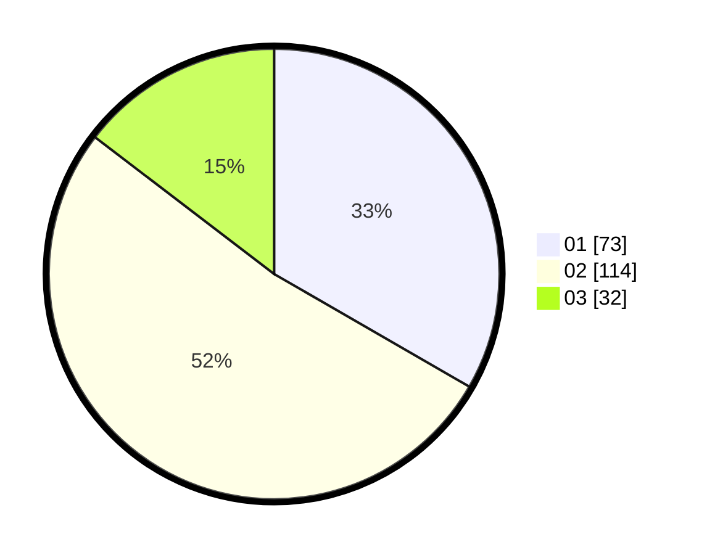

# Hasil

Hasil perolehan suara paslon dapat dilihat pada file paslon-01.txt, paslon-02.txt, dan paslon-03.txt.

Jika tidak ada, artinya data tersebut belum ada pada SIREKAP.

## Perolehan Suara

 * Paslon 01: **73**.
 * Paslon 02: **114**.
 * Paslon 03: **32**.

## Foto C Plano

https://sirekap-obj-formc.kpu.go.id/d282/pemilu/ppwp/31/73/06/10/04/3173061004103-20240216-131849--2b709e85-da8c-4d1a-a890-43a4724047cb.jpg

https://sirekap-obj-formc.kpu.go.id/d282/pemilu/ppwp/31/73/06/10/04/3173061004103-20240216-131850--ace4dfe5-a1e8-4c5f-be90-0c33dd4f3752.jpg

https://sirekap-obj-formc.kpu.go.id/d282/pemilu/ppwp/31/73/06/10/04/3173061004103-20240216-131849--ced1239d-5979-4a0f-a6b5-c423f0e2c67e.jpg

## DATA PEMILIH TETAP

Jumlah pemilih dalam DPT: **274**.
 * L: **135**.
 * P: **139**.

## DATA PENGGUNA HAK PILIH

Jumlah pengguna hak pilih dalam DPT: **217**.
 * L: **102**.
 * P: **115**.

Jumlah pengguna hak pilih dalam DPTb: **0**.
 * L: **0**.
 * P: **0**.

Jumlah pengguna hak pilih dalam DPK: **4**.
 * L: **1**.
 * P: **3**.

Jumlah pengguna hak pilih: **221**.
 * L: **103**.
 * P: **118**.

## JUMLAH SUARA SAH DAN TIDAK SAH

JUMLAH SELURUH SUARA SAH: **219**.

JUMLAH SUARA TIDAK SAH: **2**.

JUMLAH SELURUH SUARA SAH DAN SUARA TIDAK SAH: **221**.
