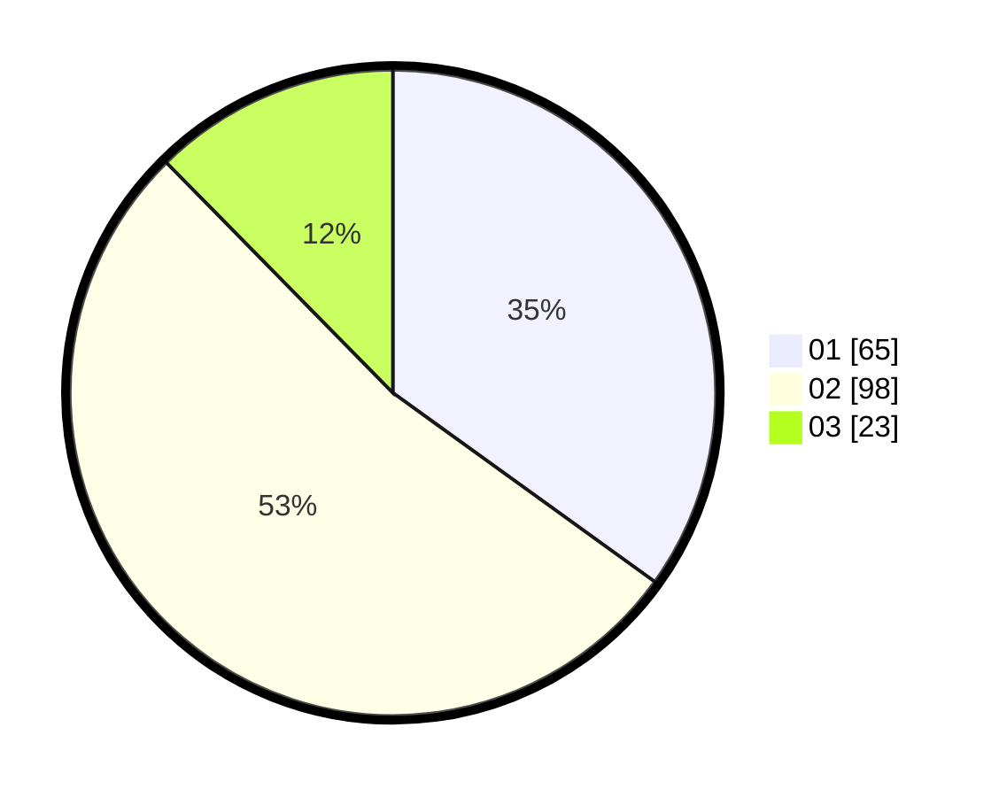

# Hasil

Hasil perolehan suara paslon dapat dilihat pada file paslon-01.txt, paslon-02.txt, dan paslon-03.txt.

Jika tidak ada, artinya data tersebut belum ada pada SIREKAP.

## Perolehan Suara

 * Paslon 01: **65**.
 * Paslon 02: **98**.
 * Paslon 03: **23**.

## Foto C Plano

https://sirekap-obj-formc.kpu.go.id/b5e1/pemilu/ppwp/31/73/06/10/04/3173061004105-20240215-214846--1d289901-aa45-4e91-9aff-6869543ae7e2.jpg

https://sirekap-obj-formc.kpu.go.id/b5e1/pemilu/ppwp/31/73/06/10/04/3173061004105-20240215-214849--c65f2376-cf54-4084-b953-379f37444785.jpg

https://sirekap-obj-formc.kpu.go.id/b5e1/pemilu/ppwp/31/73/06/10/04/3173061004105-20240215-214847--049b112b-e2a7-4b3d-ba96-24aa99bfd042.jpg

## DATA PEMILIH TETAP

Jumlah pemilih dalam DPT: **273**.
 * L: **134**.
 * P: **139**.

## DATA PENGGUNA HAK PILIH

Jumlah pengguna hak pilih dalam DPT: **190**.
 * L: **90**.
 * P: **100**.

Jumlah pengguna hak pilih dalam DPTb: **0**.
 * L: **0**.
 * P: **0**.

Jumlah pengguna hak pilih dalam DPK: **0**.
 * L: **0**.
 * P: **0**.

Jumlah pengguna hak pilih: **190**.
 * L: **90**.
 * P: **100**.

## JUMLAH SUARA SAH DAN TIDAK SAH

JUMLAH SELURUH SUARA SAH: **186**.

JUMLAH SUARA TIDAK SAH: **4**.

JUMLAH SELURUH SUARA SAH DAN SUARA TIDAK SAH: **190**.
