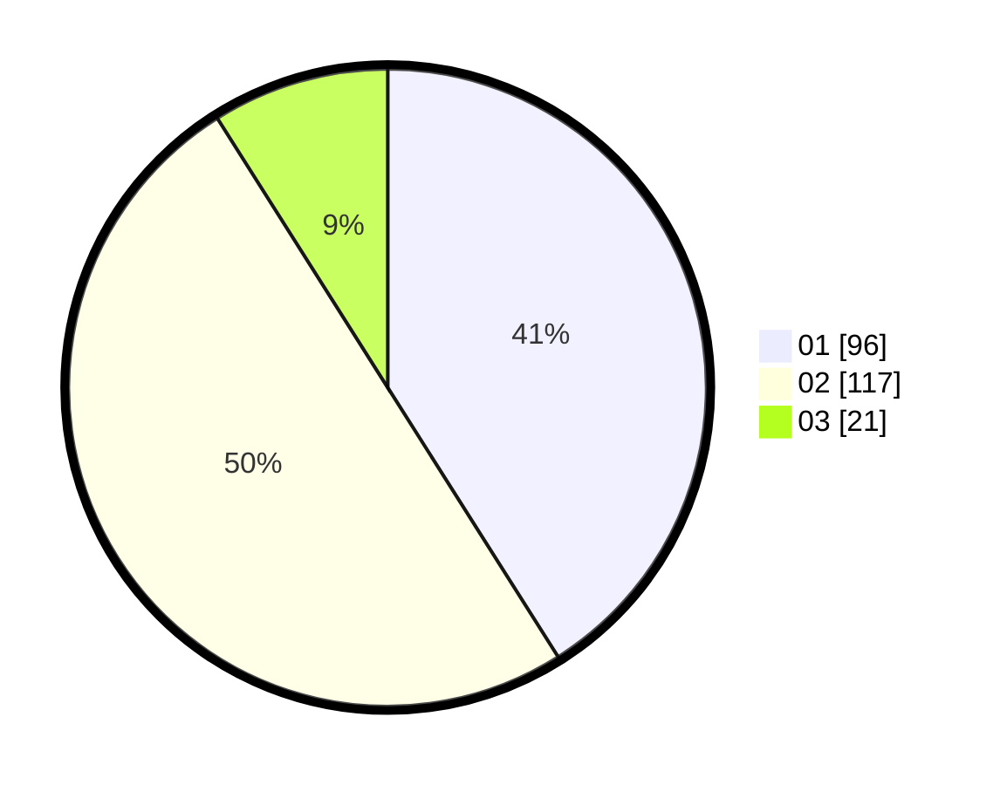

# Hasil

Hasil perolehan suara paslon dapat dilihat pada file paslon-01.txt, paslon-02.txt, dan paslon-03.txt.

Jika tidak ada, artinya data tersebut belum ada pada SIREKAP.

## Perolehan Suara

 * Paslon 01: **96**.
 * Paslon 02: **117**.
 * Paslon 03: **21**.

## Foto C Plano

https://sirekap-obj-formc.kpu.go.id/7000/pemilu/ppwp/31/73/06/10/04/3173061004107-20240216-010458--a401e01f-9ef0-4ab6-afcc-99738a26fe8a.jpg

https://sirekap-obj-formc.kpu.go.id/7000/pemilu/ppwp/31/73/06/10/04/3173061004107-20240216-010501--d1f71082-b39a-4050-93bf-58b4b8df1275.jpg

https://sirekap-obj-formc.kpu.go.id/7000/pemilu/ppwp/31/73/06/10/04/3173061004107-20240216-010500--120ea80e-eced-4908-ba5f-e0fb349e5906.jpg

## DATA PEMILIH TETAP

Jumlah pemilih dalam DPT: **275**.
 * L: **142**.
 * P: **133**.

## DATA PENGGUNA HAK PILIH

Jumlah pengguna hak pilih dalam DPT: **238**.
 * L: **129**.
 * P: **109**.

Jumlah pengguna hak pilih dalam DPTb: **0**.
 * L: **0**.
 * P: **0**.

Jumlah pengguna hak pilih dalam DPK: **0**.
 * L: **0**.
 * P: **0**.

Jumlah pengguna hak pilih: **238**.
 * L: **129**.
 * P: **109**.

## JUMLAH SUARA SAH DAN TIDAK SAH

JUMLAH SELURUH SUARA SAH: **234**.

JUMLAH SUARA TIDAK SAH: **4**.

JUMLAH SELURUH SUARA SAH DAN SUARA TIDAK SAH: **238**.
