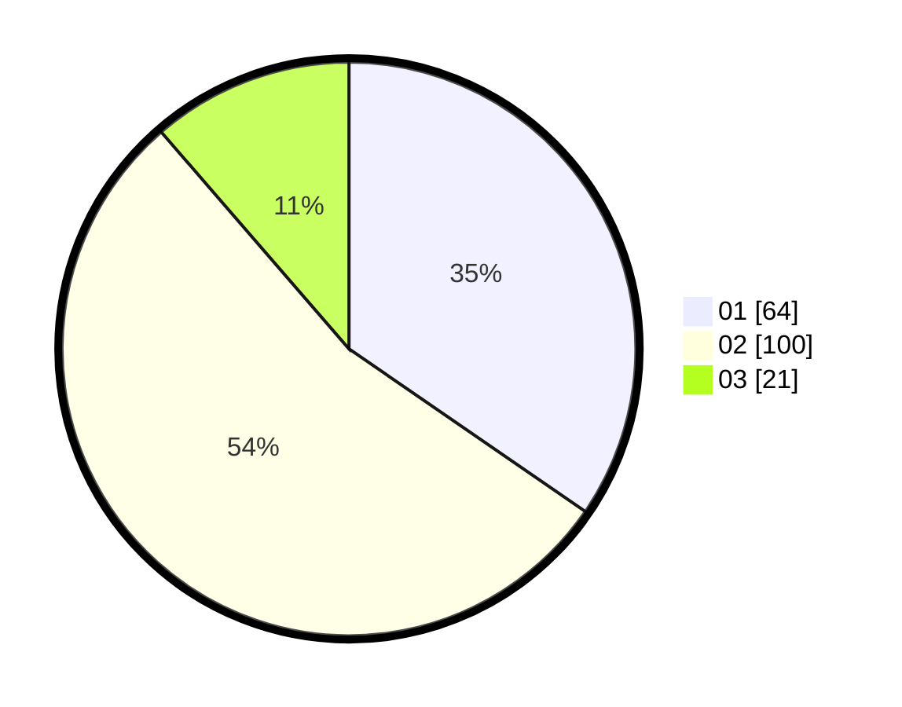

# Hasil

Hasil perolehan suara paslon dapat dilihat pada file paslon-01.txt, paslon-02.txt, dan paslon-03.txt.

Jika tidak ada, artinya data tersebut belum ada pada SIREKAP.

## Perolehan Suara

 * Paslon 01: **64**.
 * Paslon 02: **100**.
 * Paslon 03: **21**.

## Foto C Plano

https://sirekap-obj-formc.kpu.go.id/204e/pemilu/ppwp/31/73/06/10/04/3173061004113-20240216-024351--ef5a9a45-97a1-4e46-8454-87ec17a045b6.jpg

https://sirekap-obj-formc.kpu.go.id/204e/pemilu/ppwp/31/73/06/10/04/3173061004113-20240214-200157--ff123447-c775-4e1f-a2c9-a4e89c5137f0.jpg

https://sirekap-obj-formc.kpu.go.id/204e/pemilu/ppwp/31/73/06/10/04/3173061004113-20240216-024400--14ccc421-7358-4beb-973a-9590dfc3cdc7.jpg

## DATA PEMILIH TETAP

Jumlah pemilih dalam DPT: **256**.
 * L: **127**.
 * P: **129**.

## DATA PENGGUNA HAK PILIH

Jumlah pengguna hak pilih dalam DPT: **186**.
 * L: **85**.
 * P: **101**.

Jumlah pengguna hak pilih dalam DPTb: **0**.
 * L: **0**.
 * P: **0**.

Jumlah pengguna hak pilih dalam DPK: **2**.
 * L: **1**.
 * P: **1**.

Jumlah pengguna hak pilih: **188**.
 * L: **86**.
 * P: **102**.

## JUMLAH SUARA SAH DAN TIDAK SAH

JUMLAH SELURUH SUARA SAH: **185**.

JUMLAH SUARA TIDAK SAH: **3**.

JUMLAH SELURUH SUARA SAH DAN SUARA TIDAK SAH: **188**.
