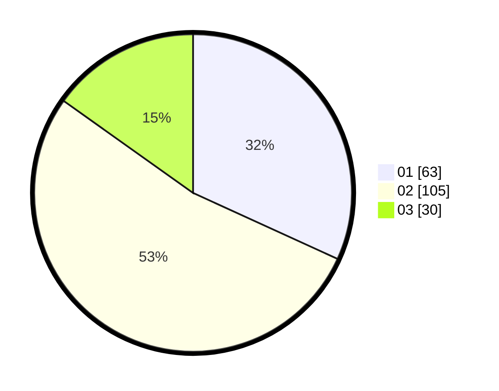

# Hasil

Hasil perolehan suara paslon dapat dilihat pada file paslon-01.txt, paslon-02.txt, dan paslon-03.txt.

Jika tidak ada, artinya data tersebut belum ada pada SIREKAP.

## Perolehan Suara

 * Paslon 01: **63**.
 * Paslon 02: **105**.
 * Paslon 03: **30**.

## Foto C Plano

https://sirekap-obj-formc.kpu.go.id/cb20/pemilu/ppwp/31/73/06/10/04/3173061004116-20240217-173855--b6139b2f-c1d8-479c-90c2-41acec2c9449.jpg

https://sirekap-obj-formc.kpu.go.id/cb20/pemilu/ppwp/31/73/06/10/04/3173061004116-20240214-214410--32de03da-50d7-4804-b31e-e6c4e4d894fd.jpg

https://sirekap-obj-formc.kpu.go.id/cb20/pemilu/ppwp/31/73/06/10/04/3173061004116-20240214-214444--e8d3b433-2f18-45a1-907e-d1bb7ff01fa5.jpg
