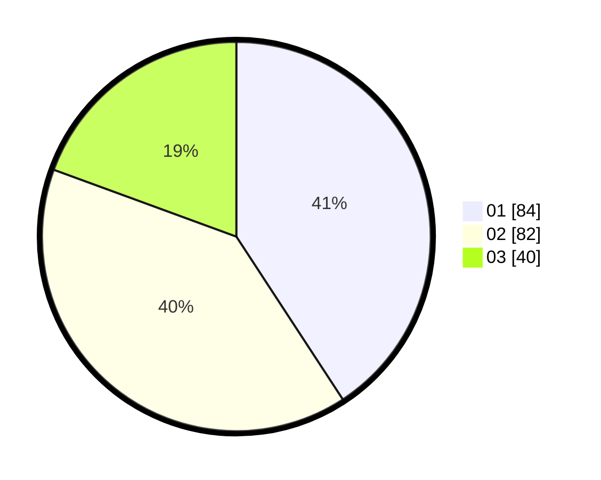

# Hasil

Hasil perolehan suara paslon dapat dilihat pada file paslon-01.txt, paslon-02.txt, dan paslon-03.txt.

Jika tidak ada, artinya data tersebut belum ada pada SIREKAP.

## Perolehan Suara

 * Paslon 01: **84**.
 * Paslon 02: **82**.
 * Paslon 03: **40**.

## Foto C Plano

https://sirekap-obj-formc.kpu.go.id/d729/pemilu/ppwp/31/73/06/10/04/3173061004121-20240216-175748--a4c73b93-d6e1-482a-ad9c-f37a96c75b2f.jpg

https://sirekap-obj-formc.kpu.go.id/d729/pemilu/ppwp/31/73/06/10/04/3173061004121-20240216-175750--22cc680d-0ed0-4279-8ad3-94c260767343.jpg

https://sirekap-obj-formc.kpu.go.id/d729/pemilu/ppwp/31/73/06/10/04/3173061004121-20240216-175749--a2ae25bd-2fc7-4076-8d66-93d16dbfb970.jpg

## DATA PEMILIH TETAP

Jumlah pemilih dalam DPT: **283**.
 * L: **133**.
 * P: **150**.

## DATA PENGGUNA HAK PILIH

Jumlah pengguna hak pilih dalam DPT: **207**.
 * L: **96**.
 * P: **111**.

Jumlah pengguna hak pilih dalam DPTb: **0**.
 * L: **0**.
 * P: **0**.

Jumlah pengguna hak pilih dalam DPK: **1**.
 * L: **1**.
 * P: **0**.

Jumlah pengguna hak pilih: **208**.
 * L: **97**.
 * P: **111**.

## JUMLAH SUARA SAH DAN TIDAK SAH

JUMLAH SELURUH SUARA SAH: **206**.

JUMLAH SUARA TIDAK SAH: **2**.

JUMLAH SELURUH SUARA SAH DAN SUARA TIDAK SAH: **208**.
