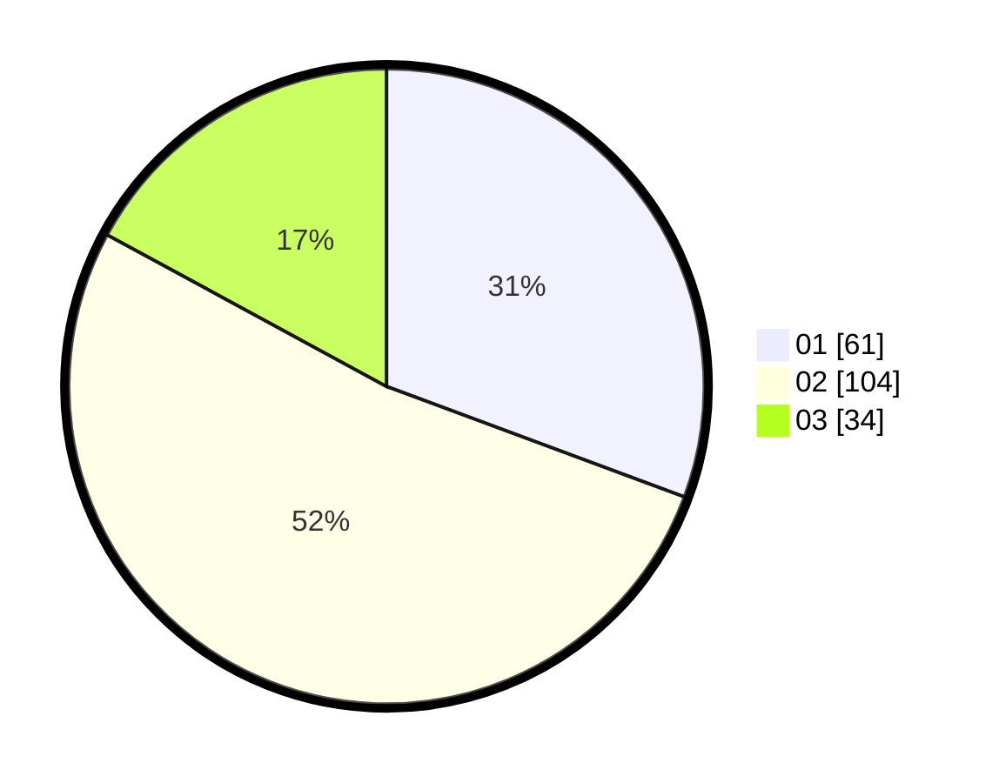

# Hasil

Hasil perolehan suara paslon dapat dilihat pada file paslon-01.txt, paslon-02.txt, dan paslon-03.txt.

Jika tidak ada, artinya data tersebut belum ada pada SIREKAP.

## Perolehan Suara

 * Paslon 01: **61**.
 * Paslon 02: **104**.
 * Paslon 03: **34**.

## Foto C Plano

https://sirekap-obj-formc.kpu.go.id/cdd3/pemilu/ppwp/31/73/06/10/04/3173061004126-20240215-142532--6e618d37-4c2c-4a85-a7d7-3ddbfcab83f0.jpg

https://sirekap-obj-formc.kpu.go.id/cdd3/pemilu/ppwp/31/73/06/10/04/3173061004126-20240215-142553--cddcc763-e09c-4e4d-b9a2-e0956398de57.jpg

https://sirekap-obj-formc.kpu.go.id/cdd3/pemilu/ppwp/31/73/06/10/04/3173061004126-20240215-142542--d302ee99-0bec-4f3b-b0f8-d9cfbaf4c3bc.jpg

## DATA PEMILIH TETAP

Jumlah pemilih dalam DPT: **269**.
 * L: **140**.
 * P: **129**.

## DATA PENGGUNA HAK PILIH

Jumlah pengguna hak pilih dalam DPT: **205**.
 * L: **105**.
 * P: **100**.

Jumlah pengguna hak pilih dalam DPTb: **0**.
 * L: **0**.
 * P: **0**.

Jumlah pengguna hak pilih dalam DPK: **0**.
 * L: **0**.
 * P: **0**.

Jumlah pengguna hak pilih: **205**.
 * L: **105**.
 * P: **100**.

## JUMLAH SUARA SAH DAN TIDAK SAH

JUMLAH SELURUH SUARA SAH: **199**.

JUMLAH SUARA TIDAK SAH: **6**.

JUMLAH SELURUH SUARA SAH DAN SUARA TIDAK SAH: **205**.
