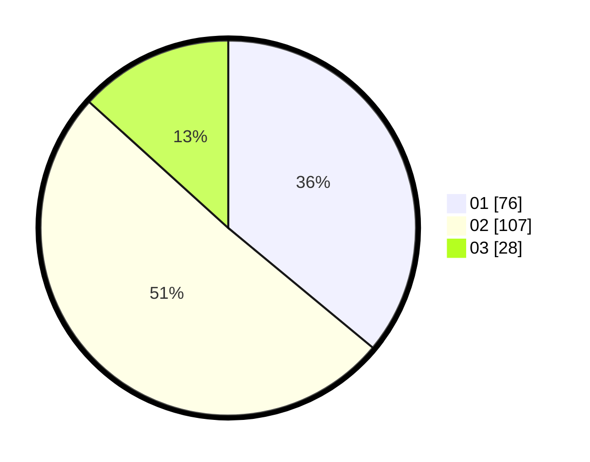

# Hasil

Hasil perolehan suara paslon dapat dilihat pada file paslon-01.txt, paslon-02.txt, dan paslon-03.txt.

Jika tidak ada, artinya data tersebut belum ada pada SIREKAP.

## Perolehan Suara

 * Paslon 01: **76**.
 * Paslon 02: **107**.
 * Paslon 03: **28**.

## Foto C Plano

https://sirekap-obj-formc.kpu.go.id/cd19/pemilu/ppwp/31/73/06/10/04/3173061004128-20240215-012121--9b93e755-cb54-4edd-a7e6-c016d2f855dc.jpg

https://sirekap-obj-formc.kpu.go.id/cd19/pemilu/ppwp/31/73/06/10/04/3173061004128-20240215-012142--d0cdd853-6e8e-4749-96a7-4a518fb88ca1.jpg

https://sirekap-obj-formc.kpu.go.id/cd19/pemilu/ppwp/31/73/06/10/04/3173061004128-20240215-012132--2199ad4f-33c6-4040-9bb2-82d86331802f.jpg

## DATA PEMILIH TETAP

Jumlah pemilih dalam DPT: **289**.
 * L: **147**.
 * P: **142**.

## DATA PENGGUNA HAK PILIH

Jumlah pengguna hak pilih dalam DPT: **210**.
 * L: **103**.
 * P: **107**.

Jumlah pengguna hak pilih dalam DPTb: **4**.
 * L: **2**.
 * P: **2**.

Jumlah pengguna hak pilih dalam DPK: **0**.
 * L: **0**.
 * P: **0**.

Jumlah pengguna hak pilih: **214**.
 * L: **105**.
 * P: **109**.

## JUMLAH SUARA SAH DAN TIDAK SAH

JUMLAH SELURUH SUARA SAH: **211**.

JUMLAH SUARA TIDAK SAH: **3**.

JUMLAH SELURUH SUARA SAH DAN SUARA TIDAK SAH: **214**.
