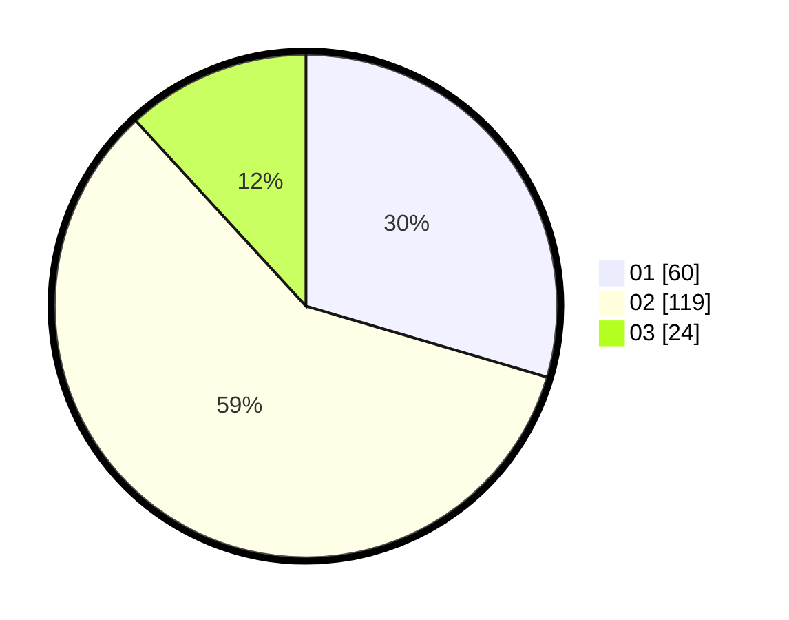

# Hasil

Hasil perolehan suara paslon dapat dilihat pada file paslon-01.txt, paslon-02.txt, dan paslon-03.txt.

Jika tidak ada, artinya data tersebut belum ada pada SIREKAP.

## Perolehan Suara

 * Paslon 01: **60**.
 * Paslon 02: **119**.
 * Paslon 03: **24**.

## Foto C Plano

https://sirekap-obj-formc.kpu.go.id/a10b/pemilu/ppwp/31/73/06/10/04/3173061004133-20240215-220431--6450ecd6-2678-4f86-9408-655417938ab8.jpg

https://sirekap-obj-formc.kpu.go.id/a10b/pemilu/ppwp/31/73/06/10/04/3173061004133-20240215-220433--1bff0ef7-0ecc-4bfe-bfd5-662d984fc732.jpg

https://sirekap-obj-formc.kpu.go.id/a10b/pemilu/ppwp/31/73/06/10/04/3173061004133-20240215-220433--1f7133ac-d687-4dc3-838a-a3d886f836d5.jpg

## DATA PEMILIH TETAP

Jumlah pemilih dalam DPT: **297**.
 * L: **152**.
 * P: **145**.

## DATA PENGGUNA HAK PILIH

Jumlah pengguna hak pilih dalam DPT: **210**.
 * L: **104**.
 * P: **106**.

Jumlah pengguna hak pilih dalam DPTb: **0**.
 * L: **0**.
 * P: **0**.

Jumlah pengguna hak pilih dalam DPK: **0**.
 * L: **0**.
 * P: **0**.

Jumlah pengguna hak pilih: **210**.
 * L: **104**.
 * P: **106**.

## JUMLAH SUARA SAH DAN TIDAK SAH

JUMLAH SELURUH SUARA SAH: **203**.

JUMLAH SUARA TIDAK SAH: **7**.

JUMLAH SELURUH SUARA SAH DAN SUARA TIDAK SAH: **210**.
