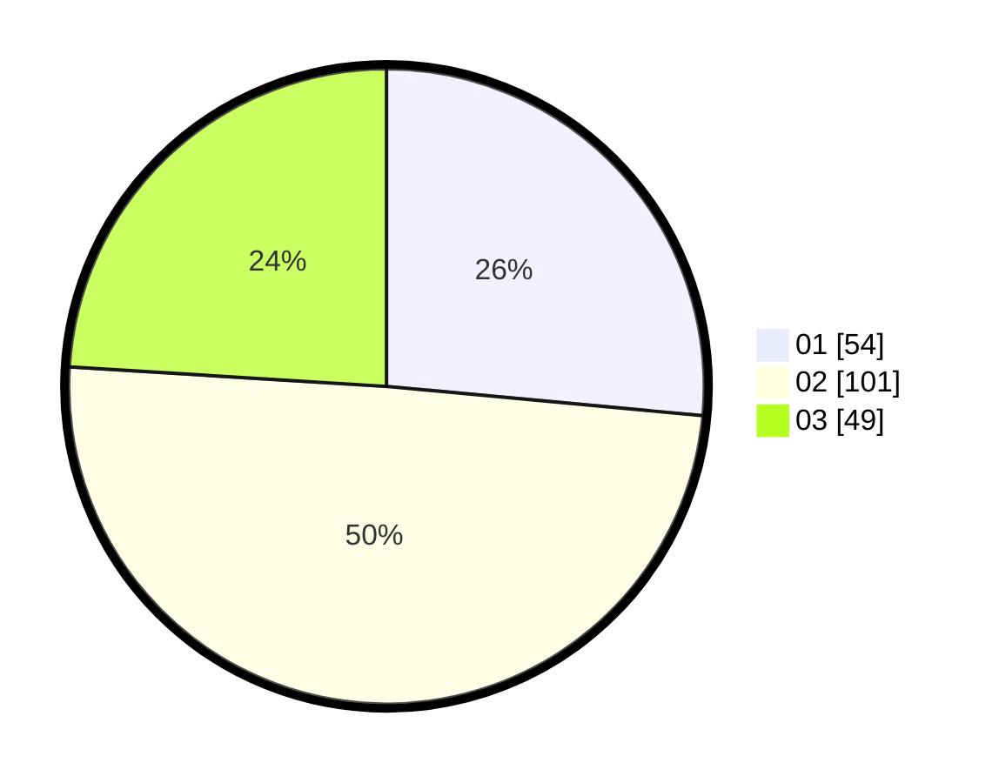

# Hasil

Hasil perolehan suara paslon dapat dilihat pada file paslon-01.txt, paslon-02.txt, dan paslon-03.txt.

Jika tidak ada, artinya data tersebut belum ada pada SIREKAP.

## Perolehan Suara

 * Paslon 01: **54**.
 * Paslon 02: **101**.
 * Paslon 03: **49**.

## Foto C Plano

https://sirekap-obj-formc.kpu.go.id/a95d/pemilu/ppwp/31/73/06/10/04/3173061004134-20240216-024721--e3cab66e-7f1e-4751-8e9b-83a17cbcb7fa.jpg

https://sirekap-obj-formc.kpu.go.id/a95d/pemilu/ppwp/31/73/06/10/04/3173061004134-20240216-024727--fa55a034-c2f7-4b67-9ae8-599a824d9685.jpg

https://sirekap-obj-formc.kpu.go.id/a95d/pemilu/ppwp/31/73/06/10/04/3173061004134-20240216-024724--ef15639b-d6d9-4262-9688-031fbc52385d.jpg

## DATA PEMILIH TETAP

Jumlah pemilih dalam DPT: **268**.
 * L: **131**.
 * P: **137**.

## DATA PENGGUNA HAK PILIH

Jumlah pengguna hak pilih dalam DPT: **205**.
 * L: **102**.
 * P: **103**.

Jumlah pengguna hak pilih dalam DPTb: **0**.
 * L: **0**.
 * P: **0**.

Jumlah pengguna hak pilih dalam DPK: **3**.
 * L: **2**.
 * P: **1**.

Jumlah pengguna hak pilih: **208**.
 * L: **104**.
 * P: **104**.

## JUMLAH SUARA SAH DAN TIDAK SAH

JUMLAH SELURUH SUARA SAH: **204**.

JUMLAH SUARA TIDAK SAH: **4**.

JUMLAH SELURUH SUARA SAH DAN SUARA TIDAK SAH: **208**.
