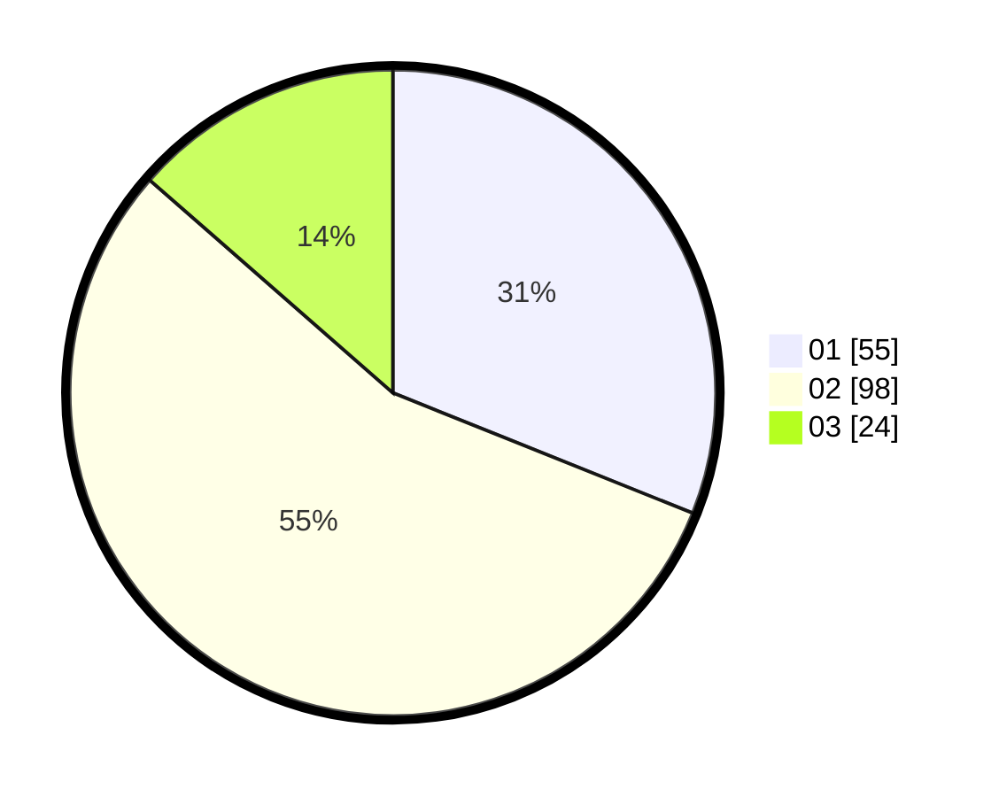

# Hasil

Hasil perolehan suara paslon dapat dilihat pada file paslon-01.txt, paslon-02.txt, dan paslon-03.txt.

Jika tidak ada, artinya data tersebut belum ada pada SIREKAP.

## Perolehan Suara

 * Paslon 01: **55**.
 * Paslon 02: **98**.
 * Paslon 03: **24**.

## Foto C Plano

https://sirekap-obj-formc.kpu.go.id/eb3d/pemilu/ppwp/31/73/06/10/04/3173061004135-20240214-194545--f3ebe5f2-1338-403c-810c-7af318c9a493.jpg

https://sirekap-obj-formc.kpu.go.id/eb3d/pemilu/ppwp/31/73/06/10/04/3173061004135-20240216-051509--3bf15b93-dd0d-441d-9a3f-abf4dc9ee8e7.jpg

https://sirekap-obj-formc.kpu.go.id/eb3d/pemilu/ppwp/31/73/06/10/04/3173061004135-20240216-051505--464a3927-6617-4b02-9ce9-676ba80500c3.jpg

## DATA PEMILIH TETAP

Jumlah pemilih dalam DPT: **262**.
 * L: **132**.
 * P: **130**.

## DATA PENGGUNA HAK PILIH

Jumlah pengguna hak pilih dalam DPT: **178**.
 * L: **88**.
 * P: **90**.

Jumlah pengguna hak pilih dalam DPTb: **0**.
 * L: **0**.
 * P: **0**.

Jumlah pengguna hak pilih dalam DPK: **2**.
 * L: **1**.
 * P: **1**.

Jumlah pengguna hak pilih: **180**.
 * L: **89**.
 * P: **91**.

## JUMLAH SUARA SAH DAN TIDAK SAH

JUMLAH SELURUH SUARA SAH: **177**.

JUMLAH SUARA TIDAK SAH: **3**.

JUMLAH SELURUH SUARA SAH DAN SUARA TIDAK SAH: **180**.
