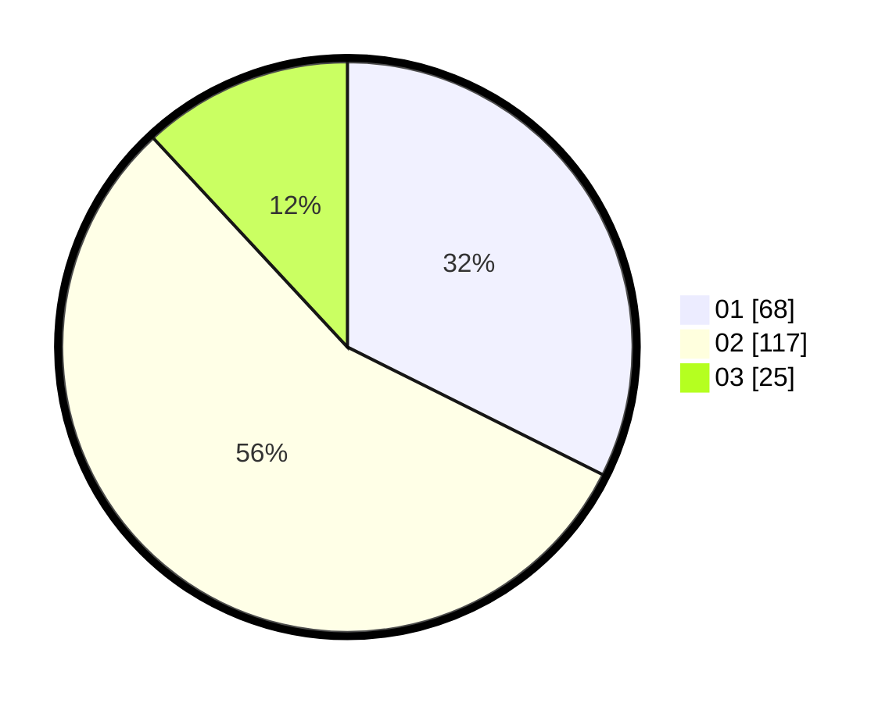

# Hasil

Hasil perolehan suara paslon dapat dilihat pada file paslon-01.txt, paslon-02.txt, dan paslon-03.txt.

Jika tidak ada, artinya data tersebut belum ada pada SIREKAP.

## Perolehan Suara

 * Paslon 01: **68**.
 * Paslon 02: **117**.
 * Paslon 03: **25**.

## Foto C Plano

https://sirekap-obj-formc.kpu.go.id/29b8/pemilu/ppwp/31/73/06/10/04/3173061004136-20240218-215947--a6888910-fd66-47dc-8c6d-5837d860f705.jpg

https://sirekap-obj-formc.kpu.go.id/29b8/pemilu/ppwp/31/73/06/10/04/3173061004136-20240218-215949--4333c566-2fc1-48df-b330-d061002b9ba1.jpg

https://sirekap-obj-formc.kpu.go.id/29b8/pemilu/ppwp/31/73/06/10/04/3173061004136-20240218-215948--3a505dca-77a2-4e6c-87ae-be18ac69c34e.jpg

## DATA PEMILIH TETAP

Jumlah pemilih dalam DPT: **277**.
 * L: **150**.
 * P: **127**.

## DATA PENGGUNA HAK PILIH

Jumlah pengguna hak pilih dalam DPT: **213**.
 * L: **113**.
 * P: **100**.

Jumlah pengguna hak pilih dalam DPTb: **0**.
 * L: **0**.
 * P: **0**.

Jumlah pengguna hak pilih dalam DPK: **0**.
 * L: **0**.
 * P: **0**.

Jumlah pengguna hak pilih: **213**.
 * L: **113**.
 * P: **100**.

## JUMLAH SUARA SAH DAN TIDAK SAH

JUMLAH SELURUH SUARA SAH: **210**.

JUMLAH SUARA TIDAK SAH: **3**.

JUMLAH SELURUH SUARA SAH DAN SUARA TIDAK SAH: **213**.
