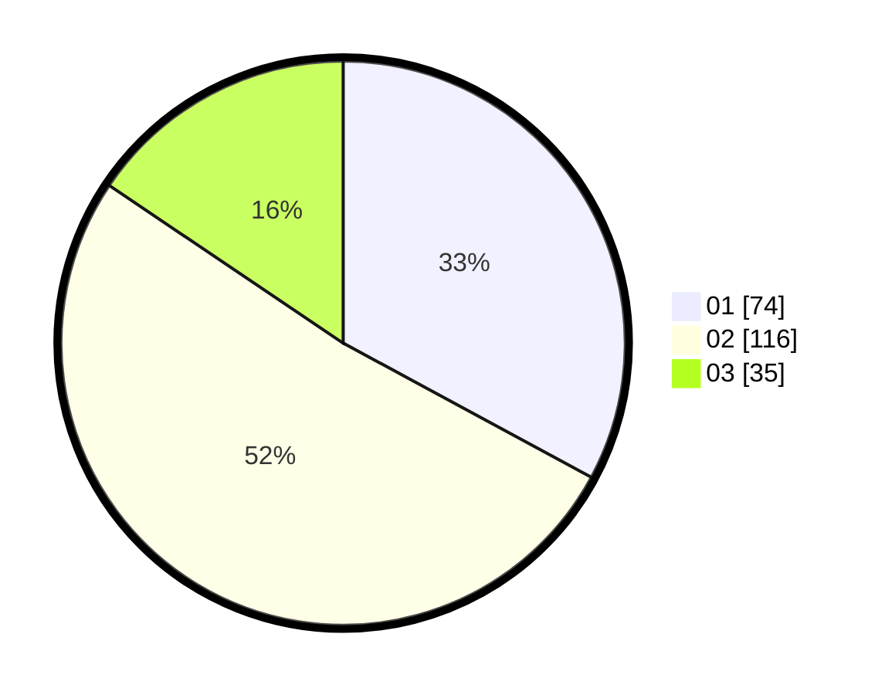

# Hasil

Hasil perolehan suara paslon dapat dilihat pada file paslon-01.txt, paslon-02.txt, dan paslon-03.txt.

Jika tidak ada, artinya data tersebut belum ada pada SIREKAP.

## Perolehan Suara

 * Paslon 01: **74**.
 * Paslon 02: **116**.
 * Paslon 03: **35**.

## Foto C Plano

https://sirekap-obj-formc.kpu.go.id/baf9/pemilu/ppwp/31/73/06/10/04/3173061004137-20240214-195125--570f9a79-3ab3-4770-9962-b4249f3f025a.jpg

https://sirekap-obj-formc.kpu.go.id/baf9/pemilu/ppwp/31/73/06/10/04/3173061004137-20240214-200704--cf7fb5ee-21fb-439a-812d-c7b659b3ab88.jpg

https://sirekap-obj-formc.kpu.go.id/baf9/pemilu/ppwp/31/73/06/10/04/3173061004137-20240214-195415--c42d0471-b514-4ed7-9f9d-6c9661efc739.jpg

## DATA PEMILIH TETAP

Jumlah pemilih dalam DPT: **293**.
 * L: **150**.
 * P: **143**.

## DATA PENGGUNA HAK PILIH

Jumlah pengguna hak pilih dalam DPT: **234**.
 * L: **119**.
 * P: **115**.

Jumlah pengguna hak pilih dalam DPTb: **0**.
 * L: **0**.
 * P: **0**.

Jumlah pengguna hak pilih dalam DPK: **0**.
 * L: **0**.
 * P: **0**.

Jumlah pengguna hak pilih: **234**.
 * L: **119**.
 * P: **115**.

## JUMLAH SUARA SAH DAN TIDAK SAH

JUMLAH SELURUH SUARA SAH: **225**.

JUMLAH SUARA TIDAK SAH: **9**.

JUMLAH SELURUH SUARA SAH DAN SUARA TIDAK SAH: **234**.
