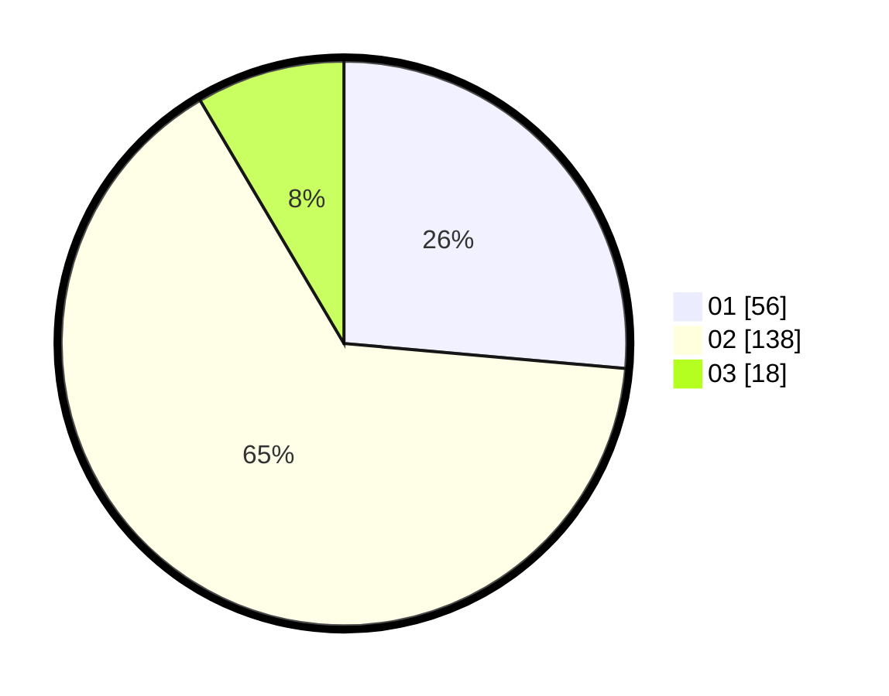

# Hasil

Hasil perolehan suara paslon dapat dilihat pada file paslon-01.txt, paslon-02.txt, dan paslon-03.txt.

Jika tidak ada, artinya data tersebut belum ada pada SIREKAP.

## Perolehan Suara

 * Paslon 01: **56**.
 * Paslon 02: **138**.
 * Paslon 03: **18**.

## Foto C Plano

https://sirekap-obj-formc.kpu.go.id/8818/pemilu/ppwp/31/73/06/10/04/3173061004140-20240216-142724--3c70d042-ac85-4a7e-9466-d174707fe3a0.jpg

https://sirekap-obj-formc.kpu.go.id/8818/pemilu/ppwp/31/73/06/10/04/3173061004140-20240216-142726--1068c1bb-f593-42f6-80a2-e9fdff52a64b.jpg

https://sirekap-obj-formc.kpu.go.id/8818/pemilu/ppwp/31/73/06/10/04/3173061004140-20240216-142725--50aeecac-60c3-41dd-810d-5399143eabb2.jpg

## DATA PEMILIH TETAP

Jumlah pemilih dalam DPT: **271**.
 * L: **150**.
 * P: **121**.

## DATA PENGGUNA HAK PILIH

Jumlah pengguna hak pilih dalam DPT: **217**.
 * L: **128**.
 * P: **97**.

Jumlah pengguna hak pilih dalam DPTb: **0**.
 * L: **0**.
 * P: **0**.

Jumlah pengguna hak pilih dalam DPK: **0**.
 * L: **0**.
 * P: **0**.

Jumlah pengguna hak pilih: **217**.
 * L: **120**.
 * P: **97**.

## JUMLAH SUARA SAH DAN TIDAK SAH

JUMLAH SELURUH SUARA SAH: **212**.

JUMLAH SUARA TIDAK SAH: **5**.

JUMLAH SELURUH SUARA SAH DAN SUARA TIDAK SAH: **217**.
