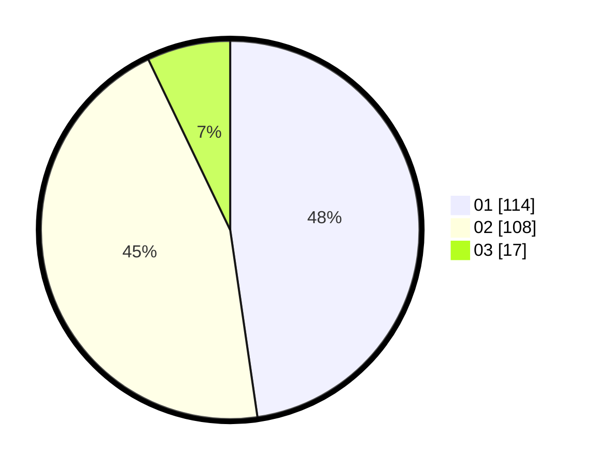

# Hasil

Hasil perolehan suara paslon dapat dilihat pada file paslon-01.txt, paslon-02.txt, dan paslon-03.txt.

Jika tidak ada, artinya data tersebut belum ada pada SIREKAP.

## Perolehan Suara

 * Paslon 01: **114**.
 * Paslon 02: **108**.
 * Paslon 03: **17**.

## Foto C Plano

https://sirekap-obj-formc.kpu.go.id/f336/pemilu/ppwp/31/73/06/10/04/3173061004145-20240215-004022--c789ac0e-c1d3-40d8-bd27-b7840aa5826f.jpg

https://sirekap-obj-formc.kpu.go.id/f336/pemilu/ppwp/31/73/06/10/04/3173061004145-20240215-004225--6ac77882-ff33-4058-92d0-d31200de75dd.jpg

https://sirekap-obj-formc.kpu.go.id/f336/pemilu/ppwp/31/73/06/10/04/3173061004145-20240215-004559--3225e296-ff52-42f3-9933-5e32ef619ae2.jpg
