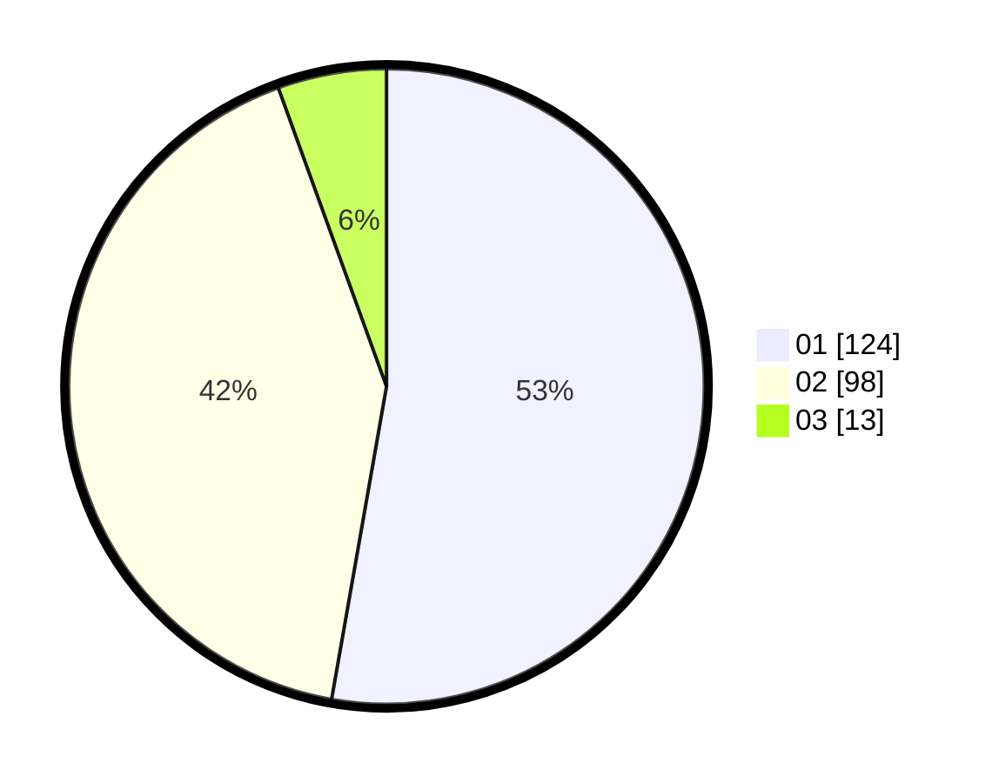

# Hasil

Hasil perolehan suara paslon dapat dilihat pada file paslon-01.txt, paslon-02.txt, dan paslon-03.txt.

Jika tidak ada, artinya data tersebut belum ada pada SIREKAP.

## Perolehan Suara

 * Paslon 01: **124**.
 * Paslon 02: **98**.
 * Paslon 03: **13**.

## Foto C Plano

https://sirekap-obj-formc.kpu.go.id/0aa9/pemilu/ppwp/31/73/06/10/04/3173061004148-20240215-001843--24bc67cd-8fed-446f-9d7e-51081cb61984.jpg

https://sirekap-obj-formc.kpu.go.id/0aa9/pemilu/ppwp/31/73/06/10/04/3173061004148-20240215-002521--486f882c-ea17-4af6-9a14-e23c8b022fe8.jpg

https://sirekap-obj-formc.kpu.go.id/0aa9/pemilu/ppwp/31/73/06/10/04/3173061004148-20240215-002721--e6d36af0-ffb6-4970-988d-93fea3d29dac.jpg
