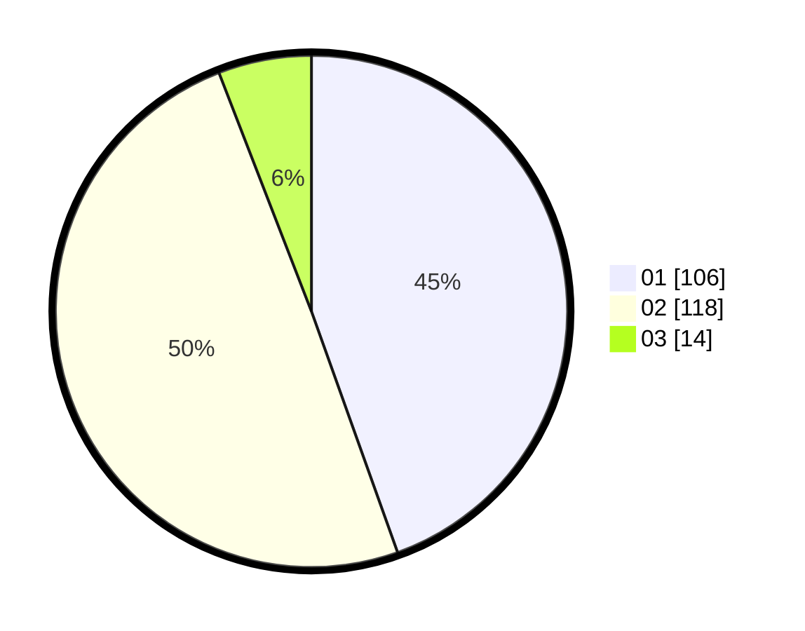

# Hasil

Hasil perolehan suara paslon dapat dilihat pada file paslon-01.txt, paslon-02.txt, dan paslon-03.txt.

Jika tidak ada, artinya data tersebut belum ada pada SIREKAP.

## Perolehan Suara

 * Paslon 01: **106**.
 * Paslon 02: **118**.
 * Paslon 03: **14**.

## Foto C Plano

https://sirekap-obj-formc.kpu.go.id/7955/pemilu/ppwp/31/73/06/10/04/3173061004150-20240216-055426--1daffe09-1796-48f3-a9fd-3be64aed5567.jpg

https://sirekap-obj-formc.kpu.go.id/7955/pemilu/ppwp/31/73/06/10/04/3173061004150-20240216-055427--b7062a6f-c129-4b0b-afe7-7856805862e8.jpg

https://sirekap-obj-formc.kpu.go.id/7955/pemilu/ppwp/31/73/06/10/04/3173061004150-20240216-055426--8c6f7b19-001c-4a33-9268-413a83cd31e9.jpg

## DATA PEMILIH TETAP

Jumlah pemilih dalam DPT: **274**.
 * L: **143**.
 * P: **131**.

## DATA PENGGUNA HAK PILIH

Jumlah pengguna hak pilih dalam DPT: **241**.
 * L: **122**.
 * P: **119**.

Jumlah pengguna hak pilih dalam DPTb: **1**.
 * L: **1**.
 * P: **0**.

Jumlah pengguna hak pilih dalam DPK: **2**.
 * L: **1**.
 * P: **1**.

Jumlah pengguna hak pilih: **244**.
 * L: **124**.
 * P: **120**.

## JUMLAH SUARA SAH DAN TIDAK SAH

JUMLAH SELURUH SUARA SAH: **238**.

JUMLAH SUARA TIDAK SAH: **6**.

JUMLAH SELURUH SUARA SAH DAN SUARA TIDAK SAH: **244**.
