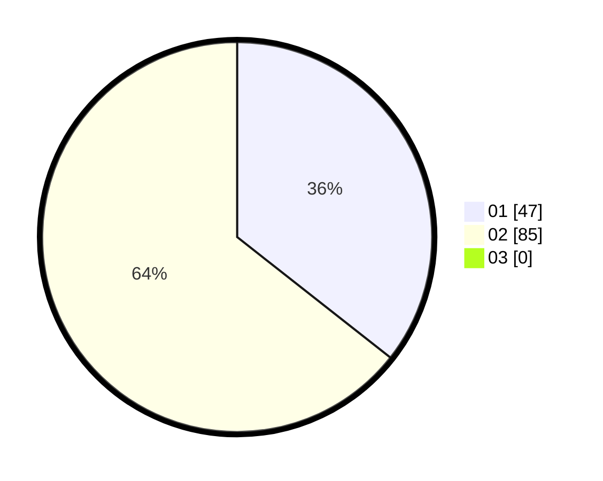

# Hasil

Hasil perolehan suara paslon dapat dilihat pada file paslon-01.txt, paslon-02.txt, dan paslon-03.txt.

Jika tidak ada, artinya data tersebut belum ada pada SIREKAP.

## Perolehan Suara

 * Paslon 01: **47**.
 * Paslon 02: **85**.
 * Paslon 03: **0**.

## Foto C Plano

https://sirekap-obj-formc.kpu.go.id/b7d4/pemilu/ppwp/31/73/06/10/04/3173061004153-20240214-194349--21317e75-6fd7-4eda-bdc3-c182a416ff20.jpg

https://sirekap-obj-formc.kpu.go.id/b7d4/pemilu/ppwp/31/73/06/10/04/3173061004153-20240214-193733--3809fda8-8ef8-4b66-8a24-0e6c3138fffe.jpg

https://sirekap-obj-formc.kpu.go.id/b7d4/pemilu/ppwp/31/73/06/10/04/3173061004153-20240214-201800--3da3f1b3-5e2f-46f1-a705-4b2d811927ec.jpg

## DATA PEMILIH TETAP

Jumlah pemilih dalam DPT: **54**.
 * L: **132**.
 * P: **175**.

## DATA PENGGUNA HAK PILIH

Jumlah pengguna hak pilih dalam DPT: **7**.
 * L: **41**.
 * P: **136**.

Jumlah pengguna hak pilih dalam DPTb: **0**.
 * L: **0**.
 * P: **0**.

Jumlah pengguna hak pilih dalam DPK: **0**.
 * L: **0**.
 * P: **0**.

Jumlah pengguna hak pilih: **207**.
 * L: **97**.
 * P: **11**.

## JUMLAH SUARA SAH DAN TIDAK SAH

JUMLAH SELURUH SUARA SAH: **7**.

JUMLAH SUARA TIDAK SAH: **4**.

JUMLAH SELURUH SUARA SAH DAN SUARA TIDAK SAH: **4**.
