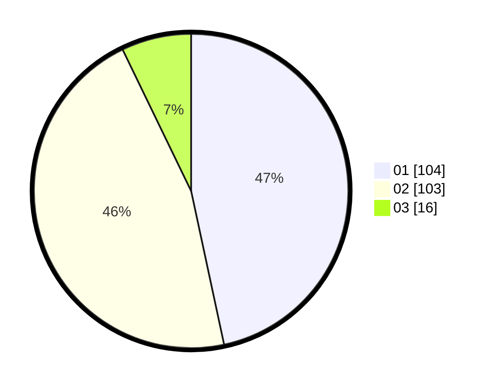

# Hasil

Hasil perolehan suara paslon dapat dilihat pada file paslon-01.txt, paslon-02.txt, dan paslon-03.txt.

Jika tidak ada, artinya data tersebut belum ada pada SIREKAP.

## Perolehan Suara

 * Paslon 01: **104**.
 * Paslon 02: **103**.
 * Paslon 03: **16**.

## Foto C Plano

https://sirekap-obj-formc.kpu.go.id/4d2d/pemilu/ppwp/31/73/06/10/04/3173061004157-20240214-193326--bbd2e8fd-7548-4a97-9e26-c19f27e53dc6.jpg

https://sirekap-obj-formc.kpu.go.id/4d2d/pemilu/ppwp/31/73/06/10/04/3173061004157-20240214-193444--8ba1fad6-7122-42eb-be5a-250444759b47.jpg

https://sirekap-obj-formc.kpu.go.id/4d2d/pemilu/ppwp/31/73/06/10/04/3173061004157-20240214-193602--7daf1037-1c92-48a7-a44e-8b63a3d2bc73.jpg

## DATA PEMILIH TETAP

Jumlah pemilih dalam DPT: **274**.
 * L: **145**.
 * P: **129**.

## DATA PENGGUNA HAK PILIH

Jumlah pengguna hak pilih dalam DPT: **223**.
 * L: **117**.
 * P: **106**.

Jumlah pengguna hak pilih dalam DPTb: **0**.
 * L: **0**.
 * P: **0**.

Jumlah pengguna hak pilih dalam DPK: **5**.
 * L: **4**.
 * P: **1**.

Jumlah pengguna hak pilih: **228**.
 * L: **121**.
 * P: **107**.

## JUMLAH SUARA SAH DAN TIDAK SAH

JUMLAH SELURUH SUARA SAH: **223**.

JUMLAH SUARA TIDAK SAH: **5**.

JUMLAH SELURUH SUARA SAH DAN SUARA TIDAK SAH: **228**.
