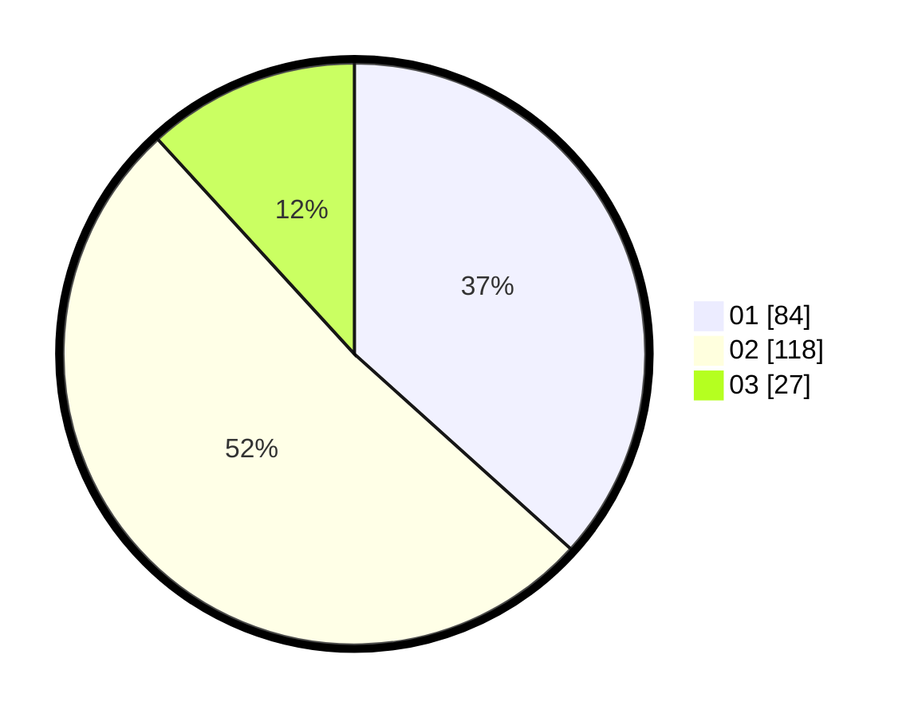

# Hasil

Hasil perolehan suara paslon dapat dilihat pada file paslon-01.txt, paslon-02.txt, dan paslon-03.txt.

Jika tidak ada, artinya data tersebut belum ada pada SIREKAP.

## Perolehan Suara

 * Paslon 01: **84**.
 * Paslon 02: **118**.
 * Paslon 03: **27**.

## Foto C Plano

https://sirekap-obj-formc.kpu.go.id/0ba3/pemilu/ppwp/31/73/06/10/04/3173061004158-20240214-234024--70f85d00-8538-496f-a3d3-5459d76a8d0a.jpg

https://sirekap-obj-formc.kpu.go.id/0ba3/pemilu/ppwp/31/73/06/10/04/3173061004158-20240214-234133--8c6d9751-64a5-41b9-8745-4c6c26060275.jpg

https://sirekap-obj-formc.kpu.go.id/0ba3/pemilu/ppwp/31/73/06/10/04/3173061004158-20240214-234227--0bace07a-e482-440a-965a-1897da1509c0.jpg
