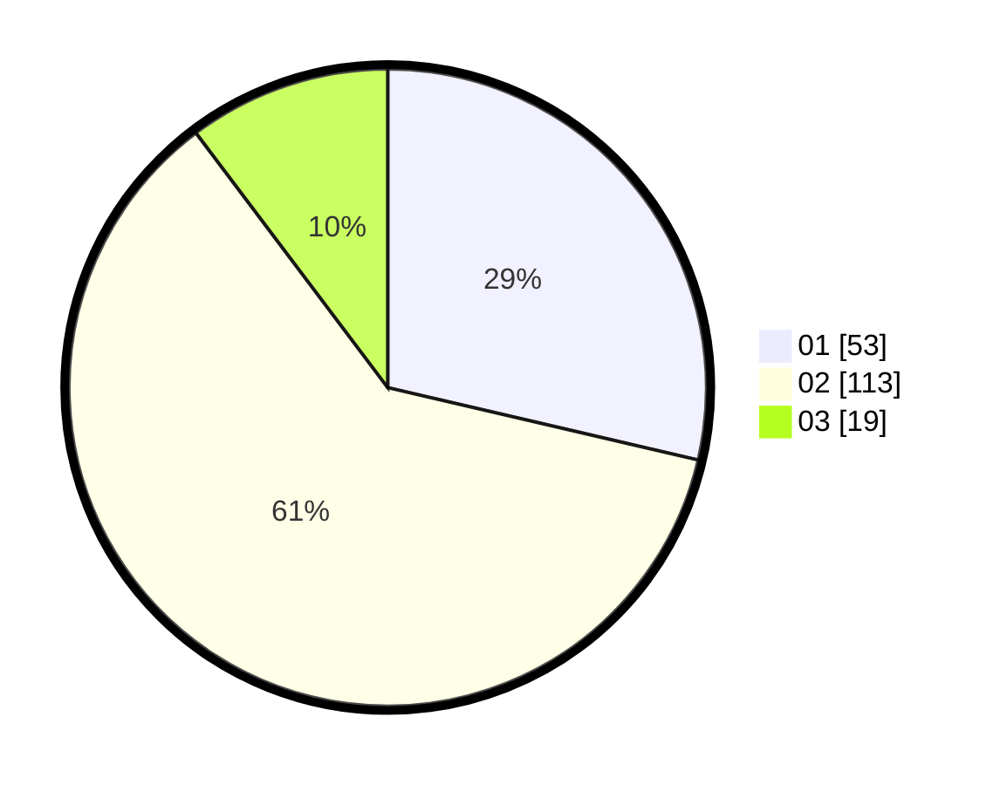

# Hasil

Hasil perolehan suara paslon dapat dilihat pada file paslon-01.txt, paslon-02.txt, dan paslon-03.txt.

Jika tidak ada, artinya data tersebut belum ada pada SIREKAP.

## Perolehan Suara

 * Paslon 01: **53**.
 * Paslon 02: **113**.
 * Paslon 03: **19**.

## Foto C Plano

https://sirekap-obj-formc.kpu.go.id/489b/pemilu/ppwp/31/73/06/10/04/3173061004163-20240216-033750--1bb48b29-3951-4cfc-ac73-0bced520bde1.jpg

https://sirekap-obj-formc.kpu.go.id/489b/pemilu/ppwp/31/73/06/10/04/3173061004163-20240216-033804--22242ad4-08d6-4b52-9492-3129d5e689c0.jpg

https://sirekap-obj-formc.kpu.go.id/489b/pemilu/ppwp/31/73/06/10/04/3173061004163-20240216-035159--8e4b5201-75c4-4f5f-a138-24613d9fd3f9.jpg

## DATA PEMILIH TETAP

Jumlah pemilih dalam DPT: **255**.
 * L: **119**.
 * P: **136**.

## DATA PENGGUNA HAK PILIH

Jumlah pengguna hak pilih dalam DPT: **189**.
 * L: **85**.
 * P: **104**.

Jumlah pengguna hak pilih dalam DPTb: **0**.
 * L: **0**.
 * P: **0**.

Jumlah pengguna hak pilih dalam DPK: **0**.
 * L: **0**.
 * P: **0**.

Jumlah pengguna hak pilih: **189**.
 * L: **85**.
 * P: **104**.

## JUMLAH SUARA SAH DAN TIDAK SAH

JUMLAH SELURUH SUARA SAH: **185**.

JUMLAH SUARA TIDAK SAH: **4**.

JUMLAH SELURUH SUARA SAH DAN SUARA TIDAK SAH: **189**.
