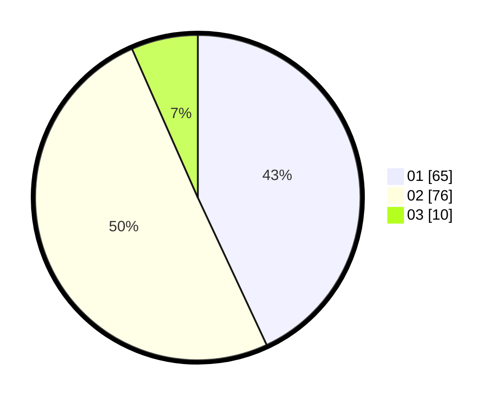

# Hasil

Hasil perolehan suara paslon dapat dilihat pada file paslon-01.txt, paslon-02.txt, dan paslon-03.txt.

Jika tidak ada, artinya data tersebut belum ada pada SIREKAP.

## Perolehan Suara

 * Paslon 01: **65**.
 * Paslon 02: **76**.
 * Paslon 03: **10**.

## Foto C Plano

https://sirekap-obj-formc.kpu.go.id/3401/pemilu/ppwp/31/73/06/10/04/3173061004179-20240216-131834--820b20e3-e184-4153-b6d9-fedf1ed78cd9.jpg

https://sirekap-obj-formc.kpu.go.id/3401/pemilu/ppwp/31/73/06/10/04/3173061004179-20240216-131835--477e986f-4e4f-40d7-aad1-cd8c0fb5aa96.jpg

https://sirekap-obj-formc.kpu.go.id/3401/pemilu/ppwp/31/73/06/10/04/3173061004179-20240216-131834--8f378d6e-6c08-4232-90b9-5816207bea44.jpg

## DATA PEMILIH TETAP

Jumlah pemilih dalam DPT: **206**.
 * L: **107**.
 * P: **99**.

## DATA PENGGUNA HAK PILIH

Jumlah pengguna hak pilih dalam DPT: **151**.
 * L: **74**.
 * P: **77**.

Jumlah pengguna hak pilih dalam DPTb: **1**.
 * L: **1**.
 * P: **0**.

Jumlah pengguna hak pilih dalam DPK: **0**.
 * L: **0**.
 * P: **0**.

Jumlah pengguna hak pilih: **152**.
 * L: **75**.
 * P: **77**.

## JUMLAH SUARA SAH DAN TIDAK SAH

JUMLAH SELURUH SUARA SAH: **151**.

JUMLAH SUARA TIDAK SAH: **1**.

JUMLAH SELURUH SUARA SAH DAN SUARA TIDAK SAH: **152**.
