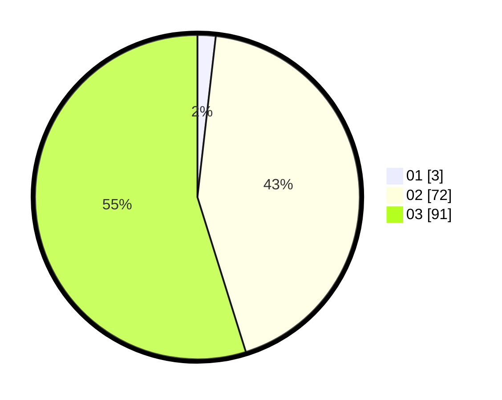

# Hasil

Hasil perolehan suara paslon dapat dilihat pada file paslon-01.txt, paslon-02.txt, dan paslon-03.txt.

Jika tidak ada, artinya data tersebut belum ada pada SIREKAP.

## Perolehan Suara

 * Paslon 01: **3**.
 * Paslon 02: **72**.
 * Paslon 03: **91**.

## Foto C Plano

https://sirekap-obj-formc.kpu.go.id/0c45/pemilu/ppwp/31/73/06/10/04/3173061004180-20240214-191910--5c043de1-23df-4d8e-8942-c966aff8c812.jpg

https://sirekap-obj-formc.kpu.go.id/0c45/pemilu/ppwp/31/73/06/10/04/3173061004180-20240214-191924--004e20d6-2264-451f-88e7-1878b05bfd62.jpg

https://sirekap-obj-formc.kpu.go.id/0c45/pemilu/ppwp/31/73/06/10/04/3173061004180-20240214-193543--3eafdd35-6678-445a-aaf9-d862e474dfe9.jpg

## DATA PEMILIH TETAP

Jumlah pemilih dalam DPT: **214**.
 * L: **106**.
 * P: **108**.

## DATA PENGGUNA HAK PILIH

Jumlah pengguna hak pilih dalam DPT: **160**.
 * L: **81**.
 * P: **79**.

Jumlah pengguna hak pilih dalam DPTb: **7**.
 * L: **2**.
 * P: **5**.

Jumlah pengguna hak pilih dalam DPK: **1**.
 * L: **0**.
 * P: **1**.

Jumlah pengguna hak pilih: **168**.
 * L: **83**.
 * P: **85**.

## JUMLAH SUARA SAH DAN TIDAK SAH

JUMLAH SELURUH SUARA SAH: **166**.

JUMLAH SUARA TIDAK SAH: **2**.

JUMLAH SELURUH SUARA SAH DAN SUARA TIDAK SAH: **168**.
