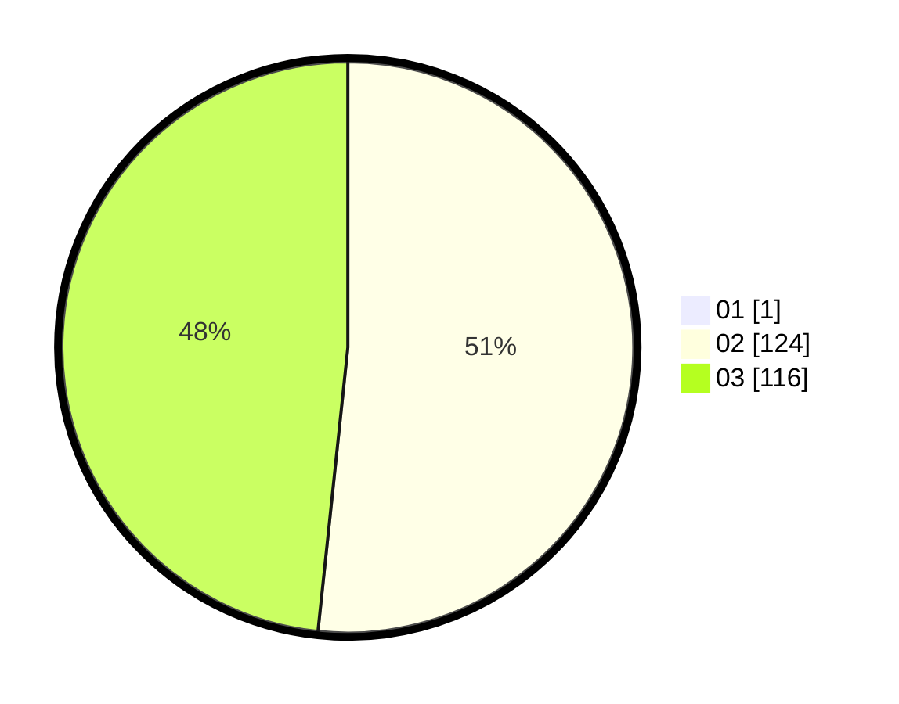

# Hasil

Hasil perolehan suara paslon dapat dilihat pada file paslon-01.txt, paslon-02.txt, dan paslon-03.txt.

Jika tidak ada, artinya data tersebut belum ada pada SIREKAP.

## Perolehan Suara

 * Paslon 01: **1**.
 * Paslon 02: **124**.
 * Paslon 03: **116**.

## Foto C Plano

https://sirekap-obj-formc.kpu.go.id/768d/pemilu/ppwp/31/73/06/10/04/3173061004182-20240214-200941--f24d215f-327d-4647-807e-09ad310154b0.jpg

https://sirekap-obj-formc.kpu.go.id/768d/pemilu/ppwp/31/73/06/10/04/3173061004182-20240214-200959--5116ed8d-58ec-4197-a854-c1ecd10ab281.jpg

https://sirekap-obj-formc.kpu.go.id/768d/pemilu/ppwp/31/73/06/10/04/3173061004182-20240214-201014--09a295c8-948a-4ce0-99a0-4d6c0546b8c1.jpg

## DATA PEMILIH TETAP

Jumlah pemilih dalam DPT: **279**.
 * L: **147**.
 * P: **132**.

## DATA PENGGUNA HAK PILIH

Jumlah pengguna hak pilih dalam DPT: **226**.
 * L: **121**.
 * P: **105**.

Jumlah pengguna hak pilih dalam DPTb: **15**.
 * L: **3**.
 * P: **12**.

Jumlah pengguna hak pilih dalam DPK: **1**.
 * L: **0**.
 * P: **1**.

Jumlah pengguna hak pilih: **242**.
 * L: **124**.
 * P: **118**.

## JUMLAH SUARA SAH DAN TIDAK SAH

JUMLAH SELURUH SUARA SAH: **238**.

JUMLAH SUARA TIDAK SAH: **4**.

JUMLAH SELURUH SUARA SAH DAN SUARA TIDAK SAH: **242**.
