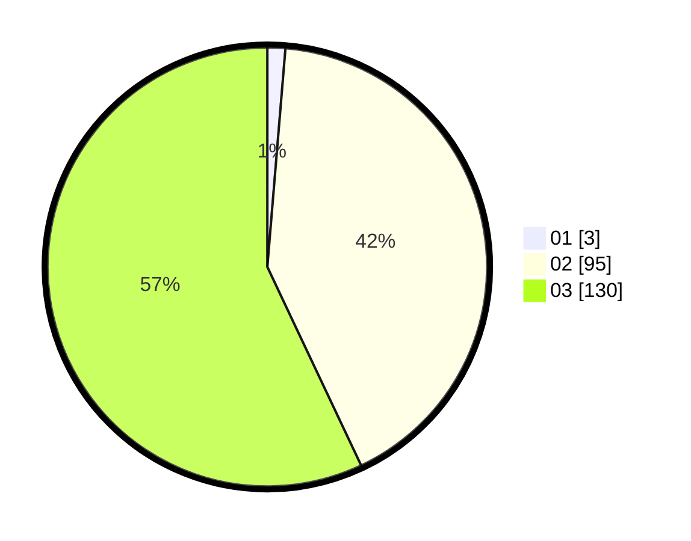

# Hasil

Hasil perolehan suara paslon dapat dilihat pada file paslon-01.txt, paslon-02.txt, dan paslon-03.txt.

Jika tidak ada, artinya data tersebut belum ada pada SIREKAP.

## Perolehan Suara

 * Paslon 01: **3**.
 * Paslon 02: **95**.
 * Paslon 03: **130**.

## Foto C Plano

https://sirekap-obj-formc.kpu.go.id/e3c2/pemilu/ppwp/31/73/06/10/04/3173061004184-20240214-201436--7ef92945-79b8-44d3-8b9e-bebb266dfcd5.jpg

https://sirekap-obj-formc.kpu.go.id/e3c2/pemilu/ppwp/31/73/06/10/04/3173061004184-20240214-195534--4f27916d-e4a7-4e15-96fc-5559ee28ee75.jpg

https://sirekap-obj-formc.kpu.go.id/e3c2/pemilu/ppwp/31/73/06/10/04/3173061004184-20240214-195723--226aae49-2e9b-40ac-b7c2-81f2988eaa70.jpg

## DATA PEMILIH TETAP

Jumlah pemilih dalam DPT: **296**.
 * L: **148**.
 * P: **148**.

## DATA PENGGUNA HAK PILIH

Jumlah pengguna hak pilih dalam DPT: **213**.
 * L: **105**.
 * P: **108**.

Jumlah pengguna hak pilih dalam DPTb: **11**.
 * L: **8**.
 * P: **3**.

Jumlah pengguna hak pilih dalam DPK: **4**.
 * L: **2**.
 * P: **2**.

Jumlah pengguna hak pilih: **228**.
 * L: **115**.
 * P: **113**.

## JUMLAH SUARA SAH DAN TIDAK SAH

JUMLAH SELURUH SUARA SAH: **228**.

JUMLAH SUARA TIDAK SAH: **0**.

JUMLAH SELURUH SUARA SAH DAN SUARA TIDAK SAH: **228**.
