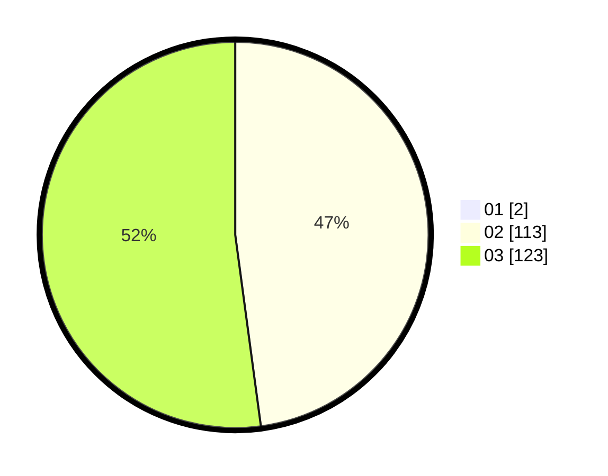

# Hasil

Hasil perolehan suara paslon dapat dilihat pada file paslon-01.txt, paslon-02.txt, dan paslon-03.txt.

Jika tidak ada, artinya data tersebut belum ada pada SIREKAP.

## Perolehan Suara

 * Paslon 01: **2**.
 * Paslon 02: **113**.
 * Paslon 03: **123**.

## Foto C Plano

https://sirekap-obj-formc.kpu.go.id/70cd/pemilu/ppwp/31/73/06/10/04/3173061004186-20240215-231932--876e6e9f-a46e-4e57-87c8-7f3edc9f8ccc.jpg

https://sirekap-obj-formc.kpu.go.id/70cd/pemilu/ppwp/31/73/06/10/04/3173061004186-20240215-231938--76f652cc-78c2-470d-a437-9e1cfda00409.jpg

https://sirekap-obj-formc.kpu.go.id/70cd/pemilu/ppwp/31/73/06/10/04/3173061004186-20240215-231937--7148c0db-bee6-4462-ac7a-4c92012d6c72.jpg

## DATA PEMILIH TETAP

Jumlah pemilih dalam DPT: **298**.
 * L: **138**.
 * P: **160**.

## DATA PENGGUNA HAK PILIH

Jumlah pengguna hak pilih dalam DPT: **239**.
 * L: **112**.
 * P: **127**.

Jumlah pengguna hak pilih dalam DPTb: **2**.
 * L: **1**.
 * P: **1**.

Jumlah pengguna hak pilih dalam DPK: **0**.
 * L: **0**.
 * P: **0**.

Jumlah pengguna hak pilih: **241**.
 * L: **113**.
 * P: **128**.

## JUMLAH SUARA SAH DAN TIDAK SAH

JUMLAH SELURUH SUARA SAH: **238**.

JUMLAH SUARA TIDAK SAH: **3**.

JUMLAH SELURUH SUARA SAH DAN SUARA TIDAK SAH: **241**.
