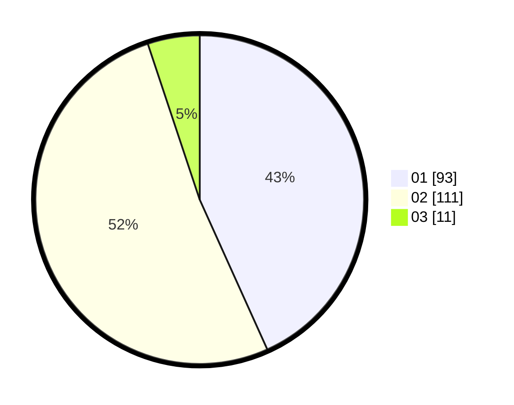

# Hasil

Hasil perolehan suara paslon dapat dilihat pada file paslon-01.txt, paslon-02.txt, dan paslon-03.txt.

Jika tidak ada, artinya data tersebut belum ada pada SIREKAP.

## Perolehan Suara

 * Paslon 01: **93**.
 * Paslon 02: **111**.
 * Paslon 03: **11**.

## Foto C Plano

https://sirekap-obj-formc.kpu.go.id/69e0/pemilu/ppwp/31/73/06/10/05/3173061005001-20240215-073839--7d5f081f-22d4-45fd-8c51-d3f8cc550306.jpg

https://sirekap-obj-formc.kpu.go.id/69e0/pemilu/ppwp/31/73/06/10/05/3173061005001-20240215-074029--4d7ca822-a232-4279-8499-cc61a8ba2444.jpg

https://sirekap-obj-formc.kpu.go.id/69e0/pemilu/ppwp/31/73/06/10/05/3173061005001-20240215-020345--c8efeae9-e22a-4ff8-ad7f-bc08bf1be4a3.jpg
