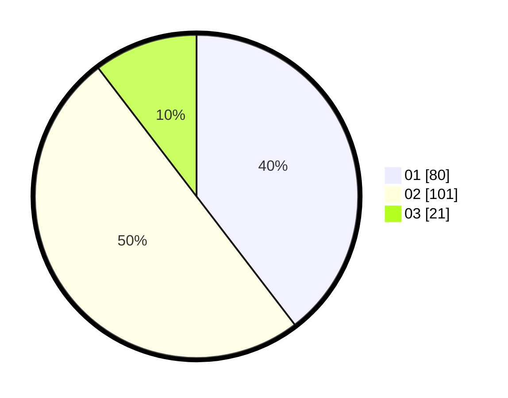

# Hasil

Hasil perolehan suara paslon dapat dilihat pada file paslon-01.txt, paslon-02.txt, dan paslon-03.txt.

Jika tidak ada, artinya data tersebut belum ada pada SIREKAP.

## Perolehan Suara

 * Paslon 01: **80**.
 * Paslon 02: **101**.
 * Paslon 03: **21**.

## Foto C Plano

https://sirekap-obj-formc.kpu.go.id/0ea9/pemilu/ppwp/31/73/06/10/05/3173061005006-20240214-212109--cca55d27-120c-4a9b-86da-0f848232c80d.jpg

https://sirekap-obj-formc.kpu.go.id/0ea9/pemilu/ppwp/31/73/06/10/05/3173061005006-20240214-212301--1468ba0d-c9d6-4975-8a4a-56b57ca829ca.jpg
